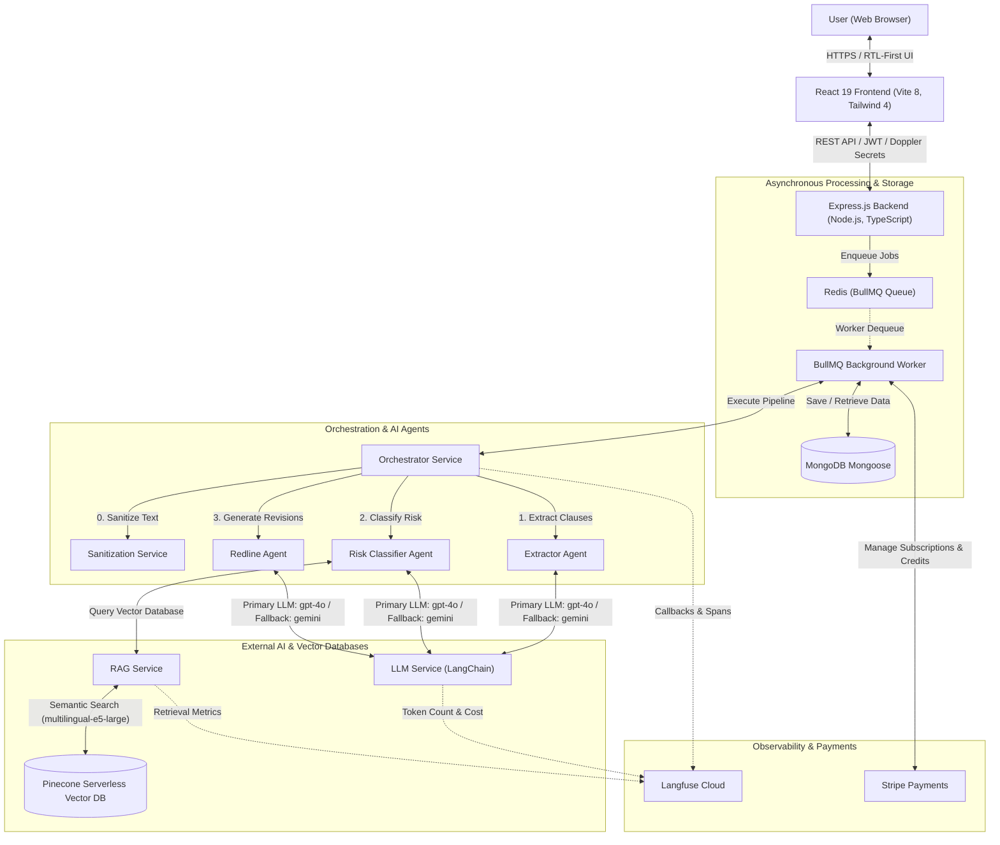

<div align="center">
  <h1>⚖️ Aqdy Platform (عَقْدِي)</h1>
  <p><strong>AI-powered contract risk analyzer grounded in Egyptian law for the Arabic-speaking market.</strong></p>

  <p>
    <a href="https://nodejs.org"></a>
    <a href="https://react.dev"></a>
    <a href="https://tailwindcss.com"></a>
    <a href="https://www.typescriptlang.org"></a>
    <a href="https://ai.google.dev"></a>
    <a href="https://langfuse.com"></a>
    <a href="https://stripe.com"></a>
    <a href="https://www.docker.com"></a>
  </p>

  <h4>
    <a href="#-quick-start">Quick Start</a> •
    <a href="#-core-features">Features</a> •
    <a href="#-system-architecture">Architecture</a> •
    <a href="#-repository-layout">Repository Structure</a> •
    <a href="#-documentation-directory">Documentation Index</a>
  </h4>
</div>

---

## 🌟 Project Overview

Aqdy helps freelancers, startups, and small businesses understand legal contracts by highlighting liabilities, providing alternative legal wordings, and explaining terms in plain language (both Arabic and English).

Upload any contract in **PDF** or **DOCX** format to retrieve:
*   🔍 **Clause-by-clause risk analysis** calibrated against Egyptian law.
*   🌍 **Bilingual (Arabic/English) explanations** with auto-detected contract language.
*   📝 **Redline revision suggestions** and negotiation talking points.
*   📚 **Citations and grounding** from a curated legal knowledge base.

---

## 🛠️ Tech Stack & Ecosystem

| Component | Technologies & Frameworks |
| :--- | :--- |
| **Backend** |     |
| **Frontend** |      |
| **AI / RAG** |    |
| **Data & Queues** |    |
| **Observability** |  |
| **Security / Dev** |    |
| **Testing** |    |

---

## ⚡ Core Features

*   **🤖 3-Agent AI Pipeline** — Sequential multi-agent orchestration for high-accuracy parsing and classification:
    1.  `ExtractorAgent` (Clause extraction & language detection)
    2.  `RiskClassifierAgent` (Egyptian law grounding and risk scoring)
    3.  `RedlineAgent` (Safer alternative generation & negotiation points)
*   **📚 Semantic RAG** — 150+ legal clauses embedded using `multilingual-e5-large` in Pinecone, retrieved with MMR (Maximal Marginal Relevance) + reranking.
*   **🌍 RTL-First & Bilingual** — Full Arabic and English support; automatically detects document languages and uses Tailwind logical properties for fluent RTL switching.
*   **⚖️ LLM-as-a-Judge** — Continuous evaluation of the RAG pipeline across 4 quality metrics: Context Precision, Context Recall, Faithfulness, and Answer Relevancy.
*   **📈 Real-time Observability** — End-to-end tracing (latencies, token count, costs per LLM call) integrated with Langfuse Cloud.
*   **🔒 Hardened Security** — Input sanitization, PII filtering, Redis rate limiting, JWT authentication, Helmet headers, and secure Doppler-managed secrets.
*   **💳 Payments & Credit Model** — Seamless Stripe integration with support for recurring subscription tiers and a tokenized credit-deduction engine.
*   **♿ Accessibility (WCAG 2.1 AA)** — Fully compliant with keyboard navigation, screen reader attributes, semantic HTML, and vitest-axe tests.
*   **💬 Human Feedback Loop** — Thumbs up/down evaluation on per-clause results and contextual issue-reporting forms.

---

## 🏗️ System Architecture

The following diagram illustrates how the frontend client, backend Express application, asynchronous BullMQ workers, and the multi-agent AI framework interact with the Pinecone vector database and Langfuse observability:



---

## 📁 Repository Layout

```
aqdy-platform/
├── backend/                     # Express API Server (Node.js/TypeScript)
│   ├── src/
│   │   ├── agents/              # Multi-agent systems & prompt libraries
│   │   ├── config/              # Redis, MongoDB, LangChain configuration
│   │   ├── models/              # Mongoose schemas (12 database collections)
│   │   ├── routes/              # Express REST endpoints (23 files)
│   │   └── services/            # AI pipelines, RAG, payments, and tracing
│   └── tests/                   # Unit, integration, & system tests (Jest)
├── frontend/                    # React client built with Vite & Tailwind CSS v4
│   ├── src/
│   │   ├── components/          # UI primitives and feature-specific components
│   │   ├── pages/               # Application page templates (15 views)
│   │   └── locales/             # Translation keys (Arabic/English)
│   └── tests/                   # Component and E2E tests (Vitest + Playwright)
├── docs/                        # Complete technical specifications & design docs
├── infra/                       # AWS CDK Infrastructure-as-Code definitions
└── docker-compose.yml           # Redis, MongoDB, Backend & Frontend local setup
```

---

## ⚡ Quick Start

### Prerequisites
Make sure you have the following tools installed on your development machine:
- **Node.js** (>= 18.0)
- **npm** (>= 9.0)
- **Docker** & **Docker Compose**

### Step 1: Clone and Set Up Environment
Copy the environment variables template:
```bash
cp .env.example .env
```
Fill in the configuration details inside `.env` (API credentials for Gemini, OpenAI, Pinecone, MongoDB Atlas, Langfuse, Stripe, and Doppler).

### Step 2: Run with Docker Compose
Run the entire stack containing backend, frontend, database, and Redis queues:
```bash
docker compose up --build
```

### Step 3: Run Manually (Local Development Mode)
If you prefer running services independently:

**Backend Server**
```bash
cd backend
npm install
npm run dev
```

**Frontend App** (In a new terminal)
```bash
cd frontend
npm install
npm run dev
```

---

## 📖 Documentation Directory

The complete guide and architecture specs are modularly organized in the [`docs/`](./docs/) directory:

| Section | Topic | Primary Reference Guides |
| :--- | :--- | :--- |
| **01 — Architecture** | System Design | [System Overview](./docs/01-ARCHITECTURE/OVERVIEW.md) • [DB Schema](./docs/01-ARCHITECTURE/DATABASE-SCHEMA.md) • [API Spec](./docs/01-ARCHITECTURE/API-SPEC.md) |
| **02 — Setup** | Run & Deploy | [Local Dev](./docs/02-SETUP/LOCAL-DEV.md) • [Deployment](./docs/02-SETUP/DEPLOYMENT.md) • [CI/CD](./docs/02-SETUP/CI-CD.md) |
| **03 — AI Pipeline** | LLMs & Agents | [Model Selection](./docs/03-AI-PIPELINE/MODEL-SELECTION.md) • [Prompt Library](./docs/03-AI-PIPELINE/PROMPT-LIBRARY.md) • [RAG Pipeline](./docs/03-AI-PIPELINE/RAG.md) • [Multi-Agent System](./docs/03-AI-PIPELINE/AGENTS.md) • [Evaluation](./docs/03-AI-PIPELINE/EVALUATION.md) |
| **04 — Security** | Guardrails | [Security Overview](./docs/04-SECURITY/OVERVIEW.md) • [RBAC Policies](./docs/04-SECURITY/RBAC.md) |
| **05 — Observability** | Tracing | [Langfuse Tracing](./docs/05-OBSERVABILITY/TRACING.md) |
| **06 — Testing** | Quality Assurance | [Unit & Integration](./docs/06-TESTING/UNIT-INTEGRATION.md) • [E2E Testing](./docs/06-TESTING/E2E.md) |
| **07 — User Guide** | Operations | [How to Use](./docs/07-USER-GUIDE/README.md) |
| **08 — Appendix** | Standards & Info | [Accessibility](./docs/08-APPENDIX/ACCESSIBILITY.md) • [Localization](./docs/08-APPENDIX/LOCALIZATION.md) • [Credits](./docs/08-APPENDIX/CREDITS.md) |

---

## 🧪 Running Tests & Quality Gates

Run the automated test suites locally to verify logic and schema compliance:

```bash
# Run backend tests (Jest)
cd backend
npm run test
npm run test:coverage       # Enforces 60% coverage gate in CI/CD pipeline

# Run frontend unit/component tests (Vitest)
cd frontend
npm run test
npm run test:coverage

# Run End-to-End browser scenarios (Playwright)
cd frontend
npm run test:e2e
```


