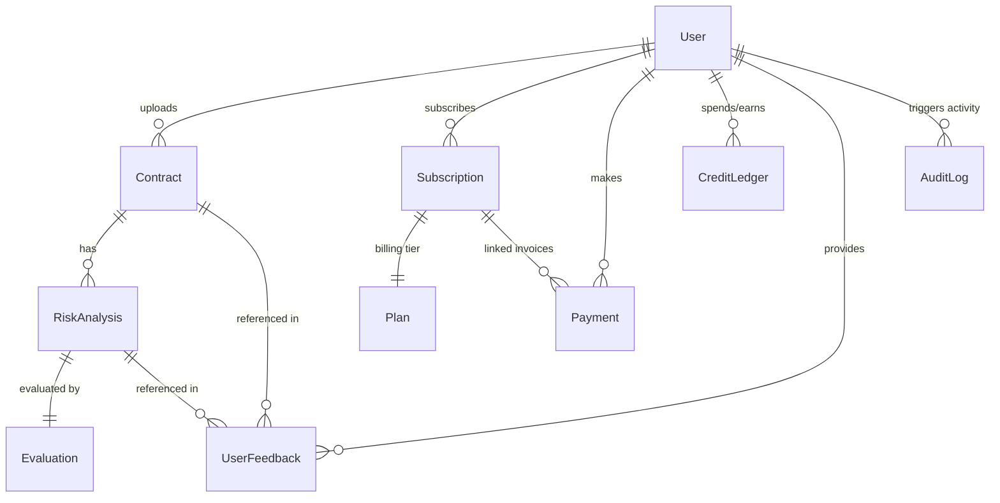

# Database Schema

> MongoDB collection schemas, validation parameters, and index designs for the Aqdy platform.

MongoDB serves as the primary document store for the Aqdy platform, persisting user profiles, uploaded contracts, analysis reports, RAG knowledge bases, audit trails, and transactional payment logs. 

---

## 🗺️ Entity Relationship Overview

The following diagram illustrates how the core collections relate to one another within the system:



---

## 🗃️ Collection Details & Schemas

### 1. User (`users` collection)
Stores user accounts, authentication hashes, Stripe references, and real-time usage credit balances.

#### Fields
| Name | Type | Required | Description |
| :--- | :--- | :--- | :--- |
| `name` | String | Yes | Full name of the user (max 100 characters). |
| `email` | String | Yes | Unique email address (lowercase, trim). |
| `passwordHash` | String | No | Salted bcrypt hash of the password (excluded by default in queries). |
| `googleId` | String | No | Google OAuth identifier (unique, sparse). |
| `role` | String | Yes | Access role (`user`, `admin`, `financial_admin`, etc.). |
| `plan` | String | Yes | Current tier display label (defaults to `"free"`). |
| `planSlug` | String | Yes | Unique slug of active tier (`"free"`, `"pro"`, `"enterprise"`). |
| `creditBalance` | Number | Yes | Numeric credit balance for API calls (minimum 0). |
| `stripeCustomerId`| String | No | Stripe Customer ID for payment management. |
| `status` | String | Yes | Account status (`"active"`, `"suspended"`, `"deleted"`). |
| `isEmailVerified` | Boolean | Yes | Email verification flag (defaults to `false`). |

#### Indexes & Purposes
- `email: 1` (Unique): Speeds up login lookup and prevents duplicate accounts.
- `googleId: 1` (Unique, Sparse): Indexes OAuth logins without breaking password-only accounts.
- `planSlug: 1`: Speeds up administration reporting.
- `stripeCustomerId: 1`: Used for resolving customer records from Stripe webhooks.
- `status: 1`: Filters active accounts quickly during authorization.

#### Schema Snippet
```typescript
const UserSchema = new Schema<IUser>(
  {
    name: { type: String, required: true, trim: true, maxlength: 100 },
    email: { type: String, required: true, unique: true, trim: true, lowercase: true, index: true },
    passwordHash: { type: String, select: false },
    googleId: { type: String, unique: true, sparse: true, index: true },
    role: { type: String, enum: ALL_ROLES, default: "user" },
    plan: { type: String, required: true, default: "free" },
    planSlug: { type: String, enum: ["free", "pro", "enterprise"], default: "free", index: true },
    creditBalance: { type: Number, default: 0, min: 0 },
    stripeCustomerId: { type: String, index: true },
    status: { type: String, enum: ["active", "suspended", "deleted"], default: "active", index: true },
    isEmailVerified: { type: Boolean, default: false },
  },
  { timestamps: true }
);
```

---

### 2. Contract (`contracts` collection)
Stores uploaded documents metadata and raw parsed text.

#### Fields
| Name | Type | Required | Description |
| :--- | :--- | :--- | :--- |
| `filename` | String | Yes | Original file name (max 255 characters). |
| `uploadedAt` | Date | Yes | Time when the document was uploaded (defaults to `now`). |
| `language` | String | Yes | Detected language (`"ar"` or `"en"`). |
| `text` | String | Yes | Full text extracted from the PDF or DOCX file. |
| `userId` | String | Yes | Reference to the owning User ID. |
| `fileSize` | Number | Yes | File size in bytes. |
| `deletedAt` | Date | No | Timestamp for soft-deleting (defaults to `null`). |

#### Indexes & Purposes
- `userId: 1`: Fetches contracts belonging to a specific user.
- `userId: 1, uploadedAt: -1`: Displays a user's contracts ordered chronologically (most recent first).
- `userId: 1, deletedAt: 1`: Optimizes lists filtering active contracts from soft-deleted ones.
- `language: 1`: Evaluates language statistics and localized workflows.

#### Schema Snippet
```typescript
const ContractSchema = new Schema<IContract>(
  {
    filename: { type: String, required: true, trim: true, maxlength: 255 },
    uploadedAt: { type: Date, default: Date.now },
    language: { type: String, enum: ["ar", "en"], required: true },
    text: { type: String, required: true },
    userId: { type: String, required: true, index: true },
    fileSize: { type: Number, required: true },
    deletedAt: { type: Date, default: null },
  },
  { timestamps: true }
);
```

---

### 3. RiskAnalysis (`riskanalyses` collection)
Saves versioned analysis records resulting from the multi-agent pipeline.

#### Fields
| Name | Type | Required | Description |
| :--- | :--- | :--- | :--- |
| `contractId` | ObjectId | Yes | Reference to the parent Contract. |
| `userId` | String | Yes | Reference to the User who triggered the analysis. |
| `version` | Number | Yes | Sequential version number (defaults to `1`). |
| `executiveSummary`| Object | Yes | Overall risk rating (`low`, `medium`, `high`, `critical`) and bilingual summaries. |
| `clauseAnalysis` | Array | Yes | Structured elements analyzing each clause (risk rating, confidence, RAG citations, and suggestions). |
| `diffSummary` | Object | No | Contains comparisons/escalations against previous versions. |
| `analysisDuration`| Number | Yes | Time taken to run the pipeline in milliseconds. |

#### Indexes & Purposes
- `contractId: 1, version: -1` (Compound, Unique): Guarantees uniqueness of each version per contract and speeds up fetching the latest iteration.
- `contractId: 1, createdAt: -1`: Fetches historical timeline data for a contract.
- `userId: 1, createdAt: -1`: Retrieves user activity stats.

#### Schema Snippet
```typescript
const RiskAnalysisSchema = new Schema<IRiskAnalysis>(
  {
    contractId: { type: Schema.Types.ObjectId, ref: "Contract", required: true, index: true },
    userId: { type: String, required: true, index: true },
    version: { type: Number, required: true, min: 1, default: 1 },
    executiveSummary: {
      overallRisk: { type: String, enum: ["low", "medium", "high", "critical"], required: true },
      totalClauses: { type: Number, required: true },
      riskyClausesCount: { type: Number, required: true },
      summary: { ar: { type: String, required: true }, en: { type: String, required: true } },
    },
    clauseAnalysis: [ClauseAnalysisSchema],
    diffSummary: { type: DiffSummarySchema, default: null },
    analysisDuration: { type: Number, required: true },
  },
  { timestamps: true }
);
```

---

### 4. Evaluation (`evaluations` collection)
Stores scorecard metrics evaluated by the `JudgeService` (LLM-as-a-Judge).

#### Fields
| Name | Type | Required | Description |
| :--- | :--- | :--- | :--- |
| `analysisId` | ObjectId | Yes | Reference to the evaluated `RiskAnalysis` record. |
| `traceId` | String | Yes | Langfuse trace identifier for tracing auditing. |
| `faithfulness` | Number | Yes | Faithfulness score (1-5 scale). |
| `relevancy` | Number | Yes | Answer relevancy score (1-5 scale). |
| `precision` | Number | Yes | Context precision score (1-5 scale). |
| `recall` | Number | Yes | Context recall score (1-5 scale). |
| `reasoning` | Object | No | Justifications for each score value. |

#### Indexes & Purposes
- `analysisId: 1` (Unique): Ensures a strict one-to-one relationship between a risk analysis report and its score evaluation.

#### Schema Snippet
```typescript
const EvaluationSchema = new Schema<IEvaluation>(
  {
    analysisId: { type: Schema.Types.ObjectId, ref: "RiskAnalysis", required: true },
    traceId: { type: String, required: true },
    faithfulness: { type: Number, min: 1, max: 5, required: true },
    relevancy: { type: Number, min: 1, max: 5, required: true },
    precision: { type: Number, min: 1, max: 5, required: true },
    recall: { type: Number, min: 1, max: 5, required: true },
    reasoning: {
      faithfulness: { type: String },
      relevancy: { type: String },
      precision: { type: String },
      recall: { type: String },
      overall: { type: String },
    },
    createdAt: { type: Date, default: Date.now, index: true },
  },
  { timestamps: false }
);
```

---

### 5. AuditLog (`AuditLog` collection)
Tracks system-wide activities for security compliance, user actions, and pipeline evaluations.

#### Fields
| Name | Type | Required | Description |
| :--- | :--- | :--- | :--- |
| `action` | String | Yes | Audited event type (e.g. `"CONTRACT_UPLOAD"`, `"ANALYSIS_COMPLETED"`). |
| `outcome` | String | Yes | Success or failure result (`"success"`, `"failure"`, `"blocked"`, `"partial"`). |
| `userId` | ObjectId | No | References the performing User. |
| `userEmail` | String | No | Emails of the user (indexed). |
| `ipAddress` | String | No | Request originating IP address. |
| `userAgent` | String | No | Request browser user agent. |
| `metadata` | Mixed | Yes | Custom key-value pairs depending on the audit action (defaults to `{}`). |
| `langfuseTraceId` | String | No | Links log events to Langfuse dashboard records. |
| `requestId` | String | No | Express correlation ID for tracing. |

#### Indexes & Purposes
- `userId: 1, action: 1, timestamp: -1`: Filters operations performed by a user over time.
- `action: 1, timestamp: -1`: Pulls specific event metrics.
- `timestamp: -1` (TTL): Automatically purges audit logs older than 2 years (`63072000` seconds) to keep storage footprint minimal.

#### Schema Snippet
```typescript
const AuditLogSchema = new Schema<IAuditLog>(
  {
    action: { type: String, required: true, enum: ACTION_TYPES },
    outcome: { type: String, required: true, enum: OUTCOMES },
    timestamp: { type: Date, default: Date.now },
    userId: { type: Schema.Types.ObjectId, ref: "User", default: null, index: true },
    userEmail: { type: String, default: null, index: true },
    ipAddress: { type: String, default: null },
    userAgent: { type: String, default: null },
    metadata: { type: Schema.Types.Mixed, default: {} },
    langfuseTraceId: { type: String, default: null, index: true },
    requestId: { type: String, default: null, index: true },
  },
  { collection: "AuditLog" }
);
```

---

### 6. KnowledgeBase (`knowledgebases` collection)
Stores curated legal entries used to populate context matches during RAG queries.

#### Fields
| Name | Type | Required | Description |
| :--- | :--- | :--- | :--- |
| `clauseText` | String | Yes | Source text of the reference legal clause. |
| `contractType` | String | Yes | Targeted contract types (e.g. `"NDA"`, `"Employment"`). |
| `category` | String | Yes | Legal category classifications (e.g. `"Termination"`, `"Liability"`). |
| `jurisdiction` | String | Yes | Target legal jurisdiction (defaults to `"General"`, aligned with Egyptian law). |
| `riskLevel` | String | Yes | Clause baseline risk rating (`low`, `medium`, `high`, `critical`). |
| `clausePattern` | String | No | Search text matcher for Pinecone keyword correlation. |

#### Indexes & Purposes
- `clauseText: "text", clausePattern: "text", category: "text"` (Compound Text Index): Powers keyword search capabilities inside the admin dashboard.
- `contractType: 1`, `category: 1`, `riskLevel: 1`: Filters specific legal rules for matching.

#### Schema Snippet
```typescript
const KnowledgeBaseSchema = new Schema<IKnowledgeBase>(
  {
    clauseText: { type: String, required: true, trim: true },
    contractType: { type: String, required: true, trim: true },
    category: { type: String, required: true, trim: true },
    jurisdiction: { type: String, required: true, trim: true, default: "General" },
    riskLevel: { type: String, enum: ["low", "medium", "high", "critical"], required: true, default: "medium" },
    clausePattern: { type: String, default: "", maxlength: 2000 },
  },
  { timestamps: true }
);
```

---

### 7. AgentPrompt (`agentprompts` collection)
Stores versioned prompts for agent instructions, editable via the Admin Dashboard.

#### Fields
| Name | Type | Required | Description |
| :--- | :--- | :--- | :--- |
| `agent` | String | Yes | Target agent (`"extractor"`, `"riskClassifier"`, `"redline"`) (unique). |
| `prompt` | String | Yes | Full system instruction prompt template. |

#### Indexes & Purposes
- `agent: 1` (Unique): Ensures only one active template exists per agent.

#### Schema Snippet
```typescript
const AgentPromptSchema = new Schema<IAgentPrompt>(
  {
    agent: { type: String, enum: ["extractor", "riskClassifier", "redline"], required: true, unique: true },
    prompt: { type: String, required: true },
  },
  { timestamps: { createdAt: false, updatedAt: true } }
);
```

---

### 8. CreditLedger (`creditledgers` collection)
Audit ledger tracking additions or deductions from user credit balances.

#### Fields
| Name | Type | Required | Description |
| :--- | :--- | :--- | :--- |
| `userId` | ObjectId | Yes | Target User account. |
| `delta` | Number | Yes | Numeric change in balance (positive for top-ups, negative for usage). |
| `balanceAfter` | Number | Yes | Resulting credit balance after this ledger entry. |
| `reason` | String | Yes | Reason enum (`"plan_topup"`, `"analysis_deduction"`, `"chat_deduction"`, `"manual_adjustment"`, `"refund"`). |
| `metadata` | Object | No | Contains tracking details like tokens used or contract references. |

#### Indexes & Purposes
- `userId: 1, createdAt: -1`: Displays historical transaction histories for billing logs.

#### Schema Snippet
```typescript
const CreditLedgerSchema = new Schema<ICreditLedger>(
  {
    userId: { type: Schema.Types.ObjectId, ref: "User", required: true, index: true },
    delta: { type: Number, required: true },
    balanceAfter: { type: Number, required: true },
    reason: { type: String, required: true, enum: ["plan_topup", "analysis_deduction", "chat_deduction", "manual_adjustment", "refund"] },
    metadata: {
      tokensUsed: { type: Number },
      hostingCost: { type: Number },
      contractId: { type: String, trim: true },
      paymentTxId: { type: String, trim: true },
    },
  },
  { timestamps: true }
);
```

---

### 9. Payment (`payments` collection)
Tracks checkout invoices and Stripe payment status outcomes.

#### Fields
| Name | Type | Required | Description |
| :--- | :--- | :--- | :--- |
| `userId` | ObjectId | Yes | Payer User references. |
| `subscriptionId` | ObjectId | Yes | Associated subscription record. |
| `amount` | Number | Yes | Cost of invoice (minimum 0). |
| `currency` | String | Yes | Uppercase currency symbol (e.g. `"USD"`, `"EGP"`). |
| `status` | String | Yes | Current transaction status (`"pending"`, `"succeeded"`, `"failed"`, `"refunded"`). |
| `provider` | String | Yes | Gateway provider (`"stripe"`). |
| `providerTxId` | String | Yes | Unique Stripe transaction reference. |

#### Indexes & Purposes
- `userId: 1, createdAt: -1`: Speeds up customer invoices rendering in profile billing menus.

#### Schema Snippet
```typescript
const PaymentSchema: Schema = new Schema(
  {
    userId: { type: Schema.Types.ObjectId, ref: "User", required: true },
    subscriptionId: { type: Schema.Types.ObjectId, ref: "Subscription", required: true },
    amount: { type: Number, required: true, min: 0 },
    currency: { type: String, required: true, uppercase: true, trim: true },
    status: { type: String, enum: ["pending", "succeeded", "failed", "refunded"], default: "pending", required: true },
    provider: { type: String, required: true },
    providerTxId: { type: String, required: true, unique: true, trim: true },
    description: { type: String },
  },
  { timestamps: true }
);
```

---

### 10. Plan (`plans` collection)
Houses the pricing and feature packages available on the platform.

#### Fields
| Name | Type | Required | Description |
| :--- | :--- | :--- | :--- |
| `name` | String | Yes | Name of the plan tier (e.g. `"Pro Plan"`). |
| `slug` | String | Yes | Unique slug ID (`"free"`, `"pro"`, `"enterprise"`). |
| `price` | Number | No | Flat pricing (null represents custom rates). |
| `billingCycle` | String | Yes | Pricing cycle frequency (`"monthly"`, `"annual"`). |
| `features` | Array | Yes | List of feature benefit bullet points. |
| `analysisLimit` | Number | Yes | Maximum analyses allowed per cycle (-1 represents unlimited). |
| `creditAllowance`| Number | Yes | Standard credits loaded per cycle. |
| `stripePriceId` | String | No | Stripe Price ID identifier. |
| `isActive` | Boolean | Yes | Plan visibility state (defaults to `true`). |

#### Indexes & Purposes
- `slug: 1` (Unique): Checks subscription tiers during checkouts.
- `isActive: 1`: Excludes deprecated offerings from checkout endpoints.

#### Schema Snippet
```typescript
const PlanSchema = new Schema<IPlan>(
  {
    name: { type: String, required: true, trim: true, maxlength: 100 },
    slug: { type: String, required: true, unique: true, trim: true, lowercase: true, index: true },
    price: { type: Number, default: null },
    billingCycle: { type: String, enum: ["monthly", "annual"], required: true },
    features: { type: [String], required: true, default: [] },
    analysisLimit: { type: Number, required: true },
    storageLimit: { type: Number, required: true },
    creditAllowance: { type: Number, required: true, default: 0, min: 0 },
    stripePriceId: { type: String, default: null },
    stripeAnnualPriceId: { type: String, default: null },
    isActive: { type: Boolean, default: true, index: true },
  },
  { timestamps: true }
);
```

---

### 11. Subscription (`subscriptions` collection)
Controls the active, billing renewal, and cancellation states of user accounts.

#### Fields
| Name | Type | Required | Description |
| :--- | :--- | :--- | :--- |
| `userId` | ObjectId | Yes | Subscribing User account reference. |
| `planId` | ObjectId | Yes | Target tier plan details reference. |
| `status` | String | Yes | State (`"active"`, `"cancelled"`, `"expired"`, `"past_due"`). |
| `stripeSubscriptionId` | String | No | Stripe API Subscription reference ID (unique, sparse). |
| `startDate` | Date | Yes | Date subscription billing began. |
| `endDate` | Date | Yes | Current period expiration date. |
| `renewalDate` | Date | Yes | Next expected charging date. |
| `cancelledAt` | Date | No | Timestamp when cancellation was requested. |

#### Indexes & Purposes
- `userId: 1, status: 1`: Verifies active authorization access during request middleware checks.
- `renewalDate: 1`: Scans subscriptions needing renewal or balance top-ups.
- `stripeSubscriptionId: 1` (Unique, Sparse): Identifies specific customer subscriptions during Stripe webhook callbacks.

#### Schema Snippet
```typescript
const SubscriptionSchema = new Schema<ISubscription>(
  {
    userId: { type: Schema.Types.ObjectId, ref: "User", required: true, index: true },
    planId: { type: Schema.Types.ObjectId, ref: "Plan", required: true },
    status: { type: String, enum: ["active", "cancelled", "expired", "past_due"], default: "active", index: true },
    stripeCustomerId: { type: String, index: true },
    stripeSubscriptionId: { type: String, index: true, unique: true, sparse: true },
    startDate: { type: Date, required: true, default: Date.now },
    endDate: { type: Date, required: true },
    renewalDate: { type: Date, required: true },
    cancelledAt: { type: Date },
  },
  { timestamps: true }
);
```

---

### 12. UserFeedback (`userfeedbacks` collection)
Stores ratings, issue report logs, and custom comments submitted by users.

#### Fields
| Name | Type | Required | Description |
| :--- | :--- | :--- | :--- |
| `userId` | ObjectId | Yes | Review author identity reference. |
| `targetType` | String | Yes | Scope of review (`"analysis"`, `"clause"`, `"chat_message"`). |
| `targetId` | String | Yes | ID of the specific target element under review. |
| `feedbackType` | String | Yes | Reaction classification (`"thumbs_up"`, `"thumbs_down"`, `"report"`). |
| `contractId` | ObjectId | No | References the relevant contract under evaluation. |
| `analysisId` | ObjectId | No | References the relevant versioned analysis report. |
| `comment` | String | No | Additional comments or issues (max 1000 characters). |
| `category` | String | No | Standard issues category (`"inaccurate"`, `"offensive"`, `"unclear"`, `"other"`). |

#### Indexes & Purposes
- `userId: 1, targetType: 1, targetId: 1` (Compound): Prevents users from submitting duplicate review logs for the same item.
- `analysisId: 1`: Aggregates feedback metrics per contract analysis report.

#### Schema Snippet
```typescript
const UserFeedbackSchema = new Schema<IUserFeedback>(
  {
    userId: { type: Schema.Types.ObjectId, ref: "User", required: true, index: true },
    targetType: { type: String, enum: ["analysis", "clause", "chat_message"], required: true },
    targetId: { type: String, required: true },
    feedbackType: { type: String, enum: ["thumbs_up", "thumbs_down", "report"], required: true },
    contractId: { type: Schema.Types.ObjectId, ref: "Contract" },
    analysisId: { type: Schema.Types.ObjectId, ref: "RiskAnalysis" },
    comment: { type: String, maxlength: 1000 },
    category: { type: String, enum: ["inaccurate", "offensive", "unclear", "other"] },
    createdAt: { type: Date, default: Date.now, index: true },
  },
  { timestamps: false }
);
```
