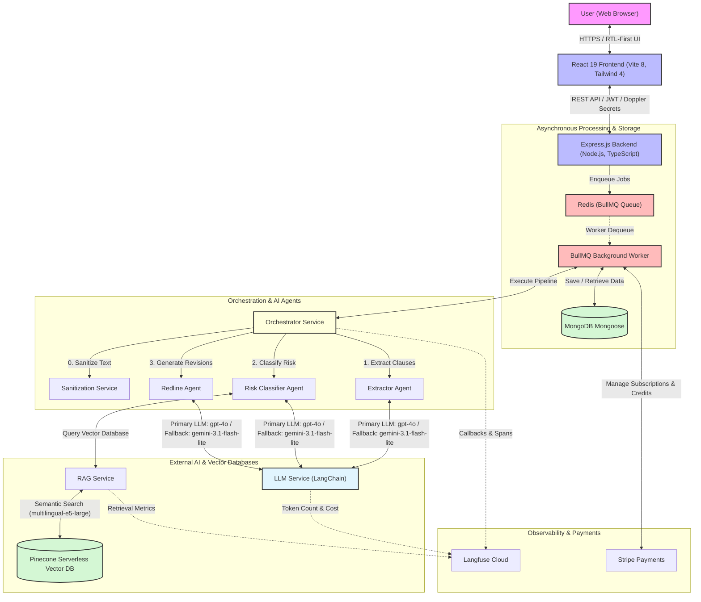

# System Architecture Overview

> High-level architecture of the Aqdy platform, illustrating how frontend services, backend processing queues, and multi-agent AI systems interact.

Aqdy is an AI-powered contract risk analyzer tailored for the Arabic-speaking market. The platform utilizes a sequential multi-agent system, semantic Retrieval-Augmented Generation (RAG) grounded in Egyptian law, and asynchronous background queues to process and analyze contracts efficiently.

---

## 🏗️ System Components & Architecture

The diagram below outlines the core components of the Aqdy platform and shows how data and execution flow between the React frontend, Express backend, Redis job queues, AI agents, and external services.



---

## 🔄 End-to-End Execution Flow

The contract analysis process coordinates multiple layers from ingestion to evaluation in a secure, non-blocking, and asynchronous fashion:

### 1. Ingestion & Pre-processing
- The user uploads a contract (PDF or DOCX format) via the React frontend.
- The frontend posts the file to the backend `/api/contracts/upload` endpoint.
- The backend parses the document structure to extract the raw text, generates a `Contract` metadata record in MongoDB, and returns the contract's identifier.

### 2. Job Enqueueing & Worker Dispatch
- The frontend requests a new analysis via the `/api/analysis/analyze` endpoint.
- The backend logs an `ANALYSIS_STARTED` event in the audit trail, compiles basic metadata, and enqueues a job containing the contract text, language, and user metadata to **Redis** using **BullMQ**.
- The API immediately returns a `202 Accepted` status with a `"processing"` payload. This decouples the client from the long-running LLM execution, allowing the frontend to poll `/api/analysis/:contractId` without encountering HTTP timeouts.

### 3. Pipeline Orchestration (AI Multi-Agent Execution)
The BullMQ worker picks up the job and delegates it to the `OrchestratorService` to run the following sequence:
- **Step 0: Sanitization:** The text passes through `SanitizationService` to clean inputs, filtering out potential prompt injection payloads and identifying sensitive parameters.
- **Step 1: Structured Clause Extraction:** The orchestrator passes the text to the `ExtractorAgent`. The agent divides large documents into chunks of 80,000 characters, automatically detects the language (Arabic or English), normalizes the text (standardizing Arabic typography and numerals), and identifies individual clauses according to a predefined 19-type taxonomy.
- **Step 2: Risk Classification with Semantic RAG:** The extracted clauses are processed concurrently (gated by `CLAUSE_ANALYSIS_CONCURRENCY`, defaulting to 5). For each clause, the `RiskClassifierAgent` is called. It uses `RAGService` to search the **Pinecone** vector database (which stores 150+ legal clauses representing Egyptian law embedded with `multilingual-e5-large`) for semantic matches. The agent combines vector similarity and LLM confidence to determine the clause's risk level (`low`, `medium`, `high`, or `critical`).
- **Step 3: Redline Generation:** For any clause with a risk level of `medium` or higher, the orchestrator invokes the `RedlineAgent` to suggest safer alternative language, guided by matching templates from the legal Knowledge Base, along with bilingual explanations and negotiation talking points.

### 4. Persistence & Post-processing
- **DB Persistence:** The final parsed output, executive summary, and per-clause analyses are saved as a versioned `RiskAnalysis` record in MongoDB. If a previous version of the analysis exists, a diff summary is generated comparing risk escalations or de-escalations.
- **Judge Evaluation (LLM-as-a-Judge):** A fire-and-forget job triggers `JudgeService` to evaluate the analysis quality against four distinct metrics (Context Precision, Context Recall, Faithfulness, and Answer Relevancy).
- **Credit Deduction:** The worker estimates token usage, converts it to credit units, and deducts the usage cost from the user's wallet via the `CreditsService` linked to Stripe.
- **Audit Logging:** An `ANALYSIS_COMPLETED` (or `ANALYSIS_FAILED`) audit record is written to the database.

---

## 🤖 The Multi-Agent Pipeline

The core logic of the analysis is driven by three specialized agents running sequentially, each with clear boundaries and fallbacks:

```
Sanitization (Step 0) → ExtractorAgent (Step 1) → RiskClassifierAgent (Step 2) → RedlineAgent (Step 3)
```

| Agent | Purpose | Key Behaviors | Output |
| :--- | :--- | :--- | :--- |
| **ExtractorAgent**<br>`extractor.agent.ts` | Identifies and extracts distinct legal clauses from the raw text. | • Automatic language detection (AR/EN)<br>• Normalization of Arabic characters and numerals<br>• Split-and-merge chunking for contracts > 80k characters<br>• Zod-based output validation with repair fallbacks | Array of structured clauses containing clause text, number, and type. |
| **RiskClassifierAgent**<br>`riskClassifier.agent.ts` | Assesses the risk level of each clause based on Egyptian law. | • Retrieves similar clauses from Pinecone via RAG<br>• Blends similarity scores (50%) and LLM confidence (50%) to calibrate risk rating<br>• Utilizes in-memory caching to bypass redundant LLM executions | Risk rating (`low`, `medium`, `high`, `critical`), bilingual explanations, and KB citations. |
| **RedlineAgent**<br>`redline.agent.ts` | Formulates legal revisions and guidelines for risky provisions. | • Uses the safer alternative from the KB as a draft template<br>• Generates bilingual revisions and negotiation tips (AR/EN)<br>• Appends a mandatory disclaimer emphasizing the output is not formal legal advice | Suggested replacement text, talking points, and bilingual explanations. |

---

## 🔌 External Service Integrations

Aqdy orchestrates several cloud services to manage storage, retrieval, payments, and observability:

### 1. Large Language Models (LLM Service)
- **Primary LLM:** OpenAI `gpt-4o` is utilized for primary agent orchestration, structured JSON outputs, and LLM-as-a-Judge evaluations due to its instruction-following accuracy.
- **Fallback LLM:** Google Gemini `gemini-3.1-flash-lite` serves as the fallback model. If the primary model fails or returns quota/rate-limit errors, the execution automatically falls back to Gemini.
- **Direct wrapper:** `gemini-1.5-pro` is used for specific fallback workflows (such as query expansion in the RAG pipeline).

### 2. Pinecone Vector Database
- **Index name:** `legal-kb`
- **Embedding model:** Pinecone's integrated inference using `multilingual-e5-large` (1024 dimensions).
- **Functionality:** Handles semantic RAG retrieval, supporting bilingual search (English/Arabic queries) with MMR reranking to diversify results and verify citations against the legal Knowledge Base.

### 3. MongoDB (Mongoose)
- **Role:** Primary document database.
- **Key Schemas:** Stores user accounts, uploaded contracts, versioned risk analyses, credit balances, plans, Stripe subscriptions, and audit logs.

### 4. Redis & BullMQ
- **Role:** Asynchronous task queue and rate limiting.
- **Functionality:** Redis manages job state and queues, while BullMQ processes heavy multi-agent execution workloads asynchronously, isolating errors and guaranteeing delivery.

### 5. Langfuse
- **Role:** LLM application observability and tracing.
- **Integration:** Hooks into LangChain's callback handler to trace LLM generations, prompt templates, token consumption, response latency, and RAG retrieval accuracy in real-time.

### 6. Stripe
- **Role:** Payment processing and billing.
- **Functionality:** Manages recurring user subscriptions, processes payment transactions, and links with the internal credits service to deduct credits after each contract analysis.
