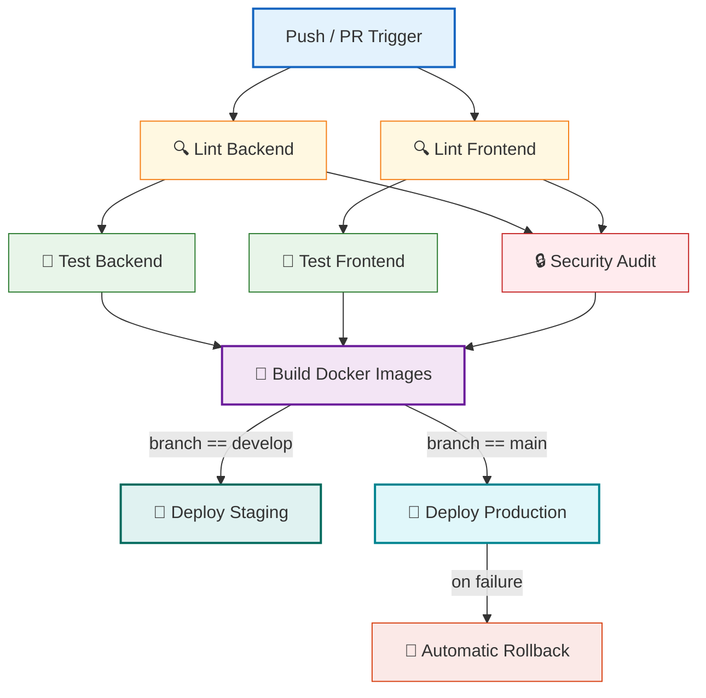

# ⚙️ CI/CD Pipeline Configuration

> Continuous Integration and Continuous Deployment workflows for linting, testing, security scanning, containerizing, and deploying the Aqdy platform.

The Aqdy platform leverages GitHub Actions for its end-to-end delivery pipeline. Every pull request and push to release branches triggers validation jobs, builds container images, and deploys zero-downtime rolling updates to Amazon ECS.

---

## 🗺️ Pipeline Orchestration Flow

The diagram below maps out how jobs depend on and transition into one another during a workflow run:



---

## 📂 Active Workflow Files

The workspace contains two main GitHub Actions configurations:

| Path | Purpose | Triggers |
| :--- | :--- | :--- |
| [ci-cd.yml](file:///.github/workflows/ci-cd.yml) | Core integration, testing, build, and deployment. | Push / PR on `develop`, `main`, `fix/pre-stage` |
| [playwright.yml](file:///.github/workflows/playwright.yml) | End-to-end browser regression test suite. | Push / PR on `main`, `master` |

---

## 🛠️ Step-by-Step Job Details

### 1. Code Quality & Formatting
*   **Backend (`lint-backend`):** Sets up Node.js 24 and runs ESLint alongside Prettier rules:
    ```bash
    npm run lint
    npm run format:check
    ```
*   **Frontend (`lint-frontend`):** Type-checks the React application with TypeScript compilation and runs Linters:
    ```bash
    npm run typecheck
    npm run lint
    npm run format:check
    ```

### 2. Integration & Coverage Testing
*   **Backend Tests (`test-backend`):** Spins up a containerized MongoDB service (`mongo:7`) for integration tests. Runs tests with coverage and fails if the quality threshold is breached:
    ```bash
    npm test -- --coverage --forceExit
    npm run coverage:check
    ```
    *   *Artifacts:* Uploads coverage logs (`backend-coverage`) with 7 days retention.
*   **Frontend Tests (`test-frontend`):** Executes Vitest units with coverage scanning:
    ```bash
    npm run test:coverage
    ```
    *   *Artifacts:* Uploads Vitest coverage reports (`frontend-coverage`).

### 3. Security Auditing (`security-audit`)
Runs concurrently after lint check validations complete:
*   **Dependency Audit:** Searches for high-severity package vulnerabilities using:
    ```bash
    npm audit --audit-level=high
    ```
*   **Secret Scanner:** Uses the `Trufflehog` Action to scan commits for committed passwords, API keys, or private credential strings.

> [!IMPORTANT]
> If any high-severity vulnerability or exposed secret is detected, the workflow fails immediately to prevent security leaks.

### 4. Container Compilation (`build`)
Compiles production Dockerfiles and pushes build layers to the GitHub Container Registry (`ghcr.io`):
*   **Images:** `ghcr.io/aqdy-platform-backend` and `ghcr.io/aqdy-platform-frontend`.
*   **Cache:** Uses GitHub Actions Cache (`type=gha`) to optimize image layer compilation times.
*   **Build Args:** Injects frontend environmental variables (`VITE_GOOGLE_CLIENT_ID`) during the Docker build stage.

---

## 🚀 AWS ECS Deployments

Aqdy utilizes AWS ECS (Elastic Container Service) for hosting. Containers are managed as ECS services inside task definitions.

### Staging Environment (`deploy-staging`)
*   **Trigger:** Successful push directly to the `develop` branch.
*   **Deployment:** Triggers a rolling update on AWS ECS cluster `aqdy-staging` using:
    ```bash
    aws ecs update-service --cluster aqdy-staging --service aqdy-platform-backend-staging --force-new-deployment
    ```
*   **Verification:** Queries the staging Application Load Balancer (ALB) DNS and executes a cURL health probe checking `/api/health`.

### Production Environment (`deploy-production`)
*   **Trigger:** Successful push directly to the `main` branches.
*   **Deployment:** Updates ECS services in the `aqdy-production` cluster.
*   **Rollback Strategy:** If the deployment fails or services do not stabilize within the timeout window, the pipeline automatically restores the previous working task configurations:
    ```bash
    aws ecs update-service --cluster aqdy-production --service aqdy-platform-production-backend --task-definition aqdy-platform-backend-previous
    ```

---

## 🔒 Secrets & Environment Management

Secrets are injected into the CI/CD pipeline from GitHub Repository Secrets:

*   `AWS_ACCESS_KEY_ID` & `AWS_SECRET_ACCESS_KEY`: Deployment credentials.
*   `OPENAI_API_KEY`, `GEMINI_API_KEY`, `PINECONE_API_KEY`: API credentials for integration testing.
*   `LANGFUSE_PUBLIC_KEY` & `LANGFUSE_SECRET_KEY`: Tracing credentials.

---

## 💻 Local Pre-Commit Hooks (Husky)

To safeguard master branches from broken commits, Aqdy uses **Husky** to enforce pre-commit checks:
*   **Configuration:** Stored under [pre-commit](file:///.husky/pre-commit).
*   **Execution:** Runs static analysis on stage-committed files using `lint-staged`.

> [!TIP]
> To bypass local pre-commit hooks temporarily (e.g. for drafting WIP changes), append `--no-verify` to your commit command:
> `git commit -m "wip: draft contract logic" --no-verify`