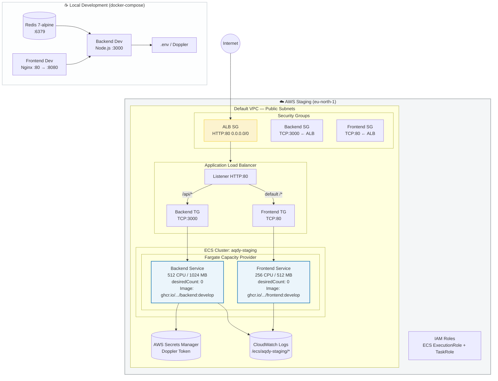
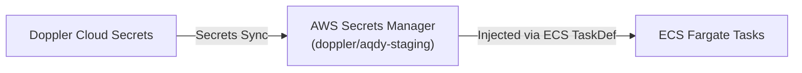

# 🚀 Deployment Guide

> Reference guide for deploying, managing, and monitoring the Aqdy Platform across local development and AWS cloud environments.

The Aqdy platform is built on a containerized, cloud-native architecture. Staging environments are managed using AWS Cloud Development Kit (CDK) to deploy resources on AWS ECS (Fargate).

---

## 🏗️ Architectural Topology

The diagram below details the platform's execution network, load balancers, and routing patterns for local and staging scopes:



---

## 📂 Deployment Artifacts

The system build files are organized as follows:

```text
├── docker-compose.yml
├── backend/
│   └── Dockerfile          # Multi-stage production Node.js build
├── frontend/
│   └── Dockerfile          # Multi-stage production Nginx & static build
└── infra/
    ├── package.json        # CDK dependencies
    └── lib/
        └── aqdy-platform-stack.ts  # Infrastructure-as-Code definitions
```

---

## 💻 Local Development Setup

To replicate production behavior locally, spin up the entire cluster using Docker Compose:

1.  **Configure Environment:**
    Ensure you have a `.env` file in the root directory. Alternatively, log into Doppler and export your service token:
    ```bash
    export DOPPLER_TOKEN=dp.st.staging_token_here
    ```
2.  **Start Services:**
    ```bash
    docker compose up --build
    ```
3.  **Ports & Access:**
    *   **Frontend UI:** `http://localhost:8080` (Proxies requests internally)
    *   **Backend Server:** `http://localhost:3000`
    *   **Redis Queue Server:** `localhost:6379`

---

## ☁️ AWS CDK Infrastructure Deployment

The staging stack (`AqdyPlatformStagingStack`) dynamically provisions Fargate services behind an Application Load Balancer.

### Deployment Prerequisites

*   Node.js installed locally.
*   AWS CLI authenticated with appropriate credentials.
*   AWS CDK CLI installed (`npm install -g aws-cdk`).

### Deploy Steps

1.  Navigate to the `infra/` folder and install dependencies:
    ```bash
    cd infra
    npm install
    ```
2.  Synthesize the CloudFormation template:
    ```bash
    cdk synth
    ```
3.  Deploy the resources to your active AWS environment:
    ```bash
    cdk deploy
    ```

---

## 🔐 Configuration & Secrets Management

Aqdy relies on **Doppler Secrets Manager** for dynamic runtime configuration. 



### Required Configuration Environment Variables

| Variable | Scope | Target Source | Description |
| :--- | :--- | :--- | :--- |
| `MONGODB_URI` | Backend | Doppler | MongoDB Atlas connection string. |
| `REDIS_URL` | Backend | Docker/AWS | Redis server URL for BullMQ. |
| `JWT_SECRET` | Backend | Doppler | Cryptographic key for user authentication cookies. |
| `STRIPE_SECRET_KEY` | Backend | Doppler | Stripe API secret key. |
| `STRIPE_WEBHOOK_SECRET` | Backend | Doppler | Signature key to verify incoming Stripe events. |
| `GEMINI_API_KEY` | Backend | Doppler | Google Gemini LLM API key. |
| `LANGFUSE_PUBLIC_KEY` | Backend | Doppler | Langfuse telemetry tracing credentials. |
| `LANGFUSE_SECRET_KEY` | Backend | Doppler | Langfuse secret credentials. |
| `VITE_API_URL` | Frontend | Build Args | Base backend URL (e.g., `/api`). |
| `VITE_GOOGLE_CLIENT_ID`| Frontend | Build Args | Google OAuth web client ID. |

---

## 🤖 AI Pipeline & Background Job Architecture

The AI processing agents run asynchronously as background worker jobs on AWS ECS:

*   **Job Queueing:** Contracts are queued via `BullMQ` which publishes payload tasks directly to Redis.
*   **Worker Instances:** Fargate Backend tasks execute `analysis.worker.ts` to consume tasks, retrieve context from pinecone database collections, execute LLM analysis via Gemini, and log metric evaluations to MongoDB.

---

## 📈 Monitoring & Observability

*   **CloudWatch Logs:** Container outputs are streamed directly to AWS CloudWatch Log Groups:
    *   `/ecs/aqdy-staging/backend`
    *   `/ecs/aqdy-staging/frontend`
*   **Telemetry Tracing:** Langfuse captures agent LLM evaluations, RAG response times, and token usage statistics.
*   **Health Endpoints:**
    *   `GET /api/health` — Returns status of MongoDB and Redis connections.
    *   `GET /api/metrics` — Exposes Prometheus telemetry metrics for load and memory metrics.
