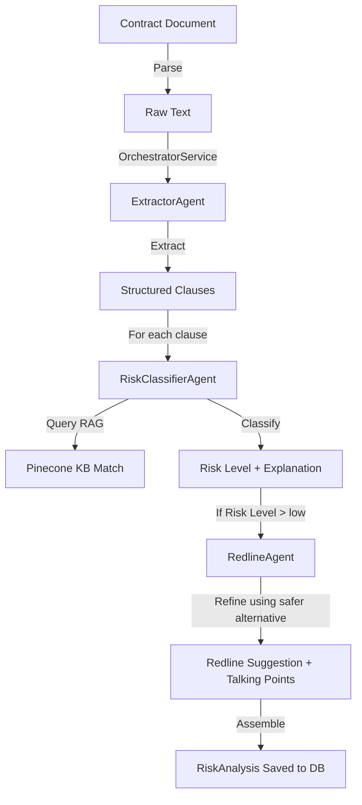

# Agentic AI — Multi-Agent System

> Three-agent pipeline with tool-use and orchestration.

## Architecture Overview (Sequential Pipeline)

- Clause classification and redlining run **concurrently** across clauses via `p-map` with `CLAUSE_ANALYSIS_CONCURRENCY` (default 5).
- Per-clause error isolation: one clause failing does **not** block others.
- **Langfuse tracing** via LangChain CallbackHandler.
- Clean separation from persistence (AnalysisService owns DB writes).
- **Input sanitization** (Step 0) via `sanitization.service.ts` prevents prompt injection.

## Agent 1 — ExtractorAgent (`backend/src/agents/extractor.agent.ts`)

- **Purpose**: Extracts structured clauses from raw contract text.
- **Key behaviors**:
  - **Auto-language detection** (Arabic/English) via `detectLanguage()`.
  - **Arabic text normalization**: NFKC normalization, alef unification, diacritics removal, Arabic-Indic numeral conversion.
  - **Chunking**: Long contracts split into chunks of 80K chars (`MAX_CHUNK_SIZE`); results merged and deduplicated across chunks.
  - **Zod schema validation** with repair fallback for malformed LLM output.
  - Default `temperature: 0.1`, `maxTokens: 8192`.
- **Output**: Array of `{ clauseNumber, clauseText, clauseType, confidence }` from a 19-type taxonomy (termination, payment, liability, non-compete, etc.).

## Agent 2 — RiskClassifierAgent (`backend/src/agents/riskClassifier.agent.ts`)

- **Purpose**: Classifies each clause's risk level with RAG context.
- **Key behaviors**:
  - **RAG-aware**: Queries `ragService.searchKB()` for semantically similar KB clauses.
  - **Confidence calibration**: Blends KB vector similarity score (50%) with LLM confidence (50%).
  - Penalizes when no KB match found (0.9 multiplier).
  - Similarity threshold for KB acceptance: 0.75.
  - In-memory cache (keyed by `text + type + language` hash).
  - Default `temperature: 0.1`, `maxTokens: 2048`.
- **Output**: `{ riskLevel (low|medium|high|critical), explanation (ar/en), confidence, sourceFromKB, saferAlternative }`.

## Agent 3 — RedlineAgent (`backend/src/agents/redline.agent.ts`)

- **Purpose**: Generates safer alternative text for risky clauses (medium, high, critical).
- **Key behaviors**:
  - Uses `saferAlternative` from KB as guiding template when available.
  - Slightly higher `temperature: 0.2` for creative/negotiation suggestions.
  - Bilingual output (explanation + talking points in both AR/EN).
  - Confidence boost (1.05x) when KB alternative present, penalty (0.95x) when absent.
  - In-memory cache.
  - **Mandatory bilingual disclaimer**: Suggestions are for negotiation only, not legal advice.
- **Output**: `{ suggestedText, explanation (ar/en), talkingPoints (ar[], en[]), confidence }`.

## Tools Available to Each Agent

| Agent | Tool | Location |
|-------|------|----------|
| ExtractorAgent | `llmService.call()` (GPT-4o → Gemini fallback) | `backend/src/services/llm.service.ts` |
| RiskClassifierAgent | `ragService.searchKB()` (Pinecone vector search) | `backend/src/services/rag.service.ts` |
| RiskClassifierAgent | `llmService.call()` | `backend/src/services/llm.service.ts` |
| RedlineAgent | `llmService.call()` | `backend/src/services/llm.service.ts` |

## LangChain Framework Integration

- All agents use **LangChain** via `@langchain/openai` (GPT-4o) and `@langchain/google-genai` (Gemini).
- **LangChain CallbackHandler** integrated with **Langfuse** for observability (`@langfuse/langchain`).
- Agent prompts are managed through LangChain's `SystemMessage` / `HumanMessage` pattern.
- Each agent call is wrapped with `traceAgent()` for structured Langfuse span tracking.

## Fallback and Error Handling

- **LLM fallback chain**: GPT-4o (3 retries) → Gemini 3.1 Flash Lite (3 retries) → throw error.
- **Agent retries**: `AgentExecutionService` provides a generic retry-enabled execution queue (default 3 attempts, 2s delay, exponential backoff).
- **Per-clause isolation**: If one clause's classification or redlining fails, it gets a safe default (`riskLevel: "unknown"`) and the pipeline continues.
- **KB search failure**: RAG errors are caught gracefully — classification proceeds without KB context.
- **Prompt service fallback**: If MongoDB `AgentPrompt` collection is unavailable, compiled-in constants from `.prompts.ts` files are used.
- **Credits deduction failure**: Logged but does not block analysis completion.
