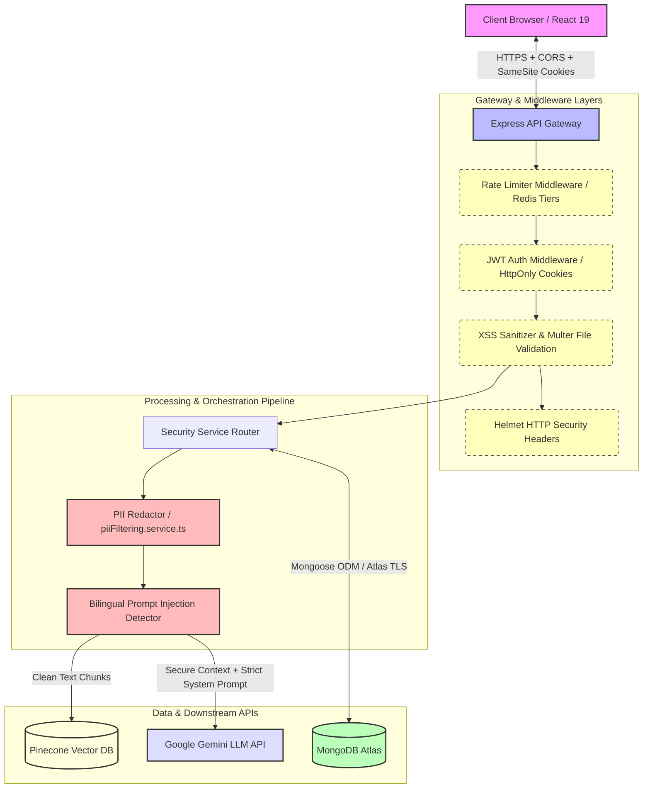

# Security & Safety Overview 🛡️

This document outlines the security architecture, input validation, guardrails, and compliance controls implemented across the Aqdy contract analysis platform.

---

## 🏗️ Security Architecture

The diagram below illustrates how secure boundaries, encryption, token authentication, rate limiting, and filtering mechanisms safeguard user data and protect LLM infrastructure from abuse:

---

## 🛡️ Core Security Defenses

### 1. Input Sanitization & Validation
- **HTML & XSS Protection**: All text inputs are filtered using a regex-based HTML/script sanitizer (`sanitizeText` in `security.middleware.ts`) to strip active script blocks, null bytes (`\0`), and generic HTML tags prior to DB storage.
- **File Upload Limits**: File uploads are handled via Multer with strict MIME validation (allowing only `.pdf` and `.docx`) and a hard **10MB** file size limit.
- **Zod Validation**: API endpoints enforce strict JSON body structures using Zod schemas at the router level.

### 2. System Prompt Protection
- **Bilingual Prompt Injection Detection**: Incoming document texts are scanned by `SanitizationService` (`detectPromptInjection` in `security.middleware.ts`) against 20+ English and Arabic jailbreak regex patterns (e.g. instructions override attempts). Malicious payloads are neutralized with `[INSTRUCTION_OVERRIDE_REMOVED]` before being sent to the LLM.
- **Instruction Grounding**: System instructions explicitly command the LLM to restrict responses to the provided contract text and refuse to speculation.

### 3. Output Guardrails & PII Filtering
- **PII Scrubbing**: Before contract texts are written to MongoDB or sent to the LLM context, `piiFiltering.service.ts` redacts Egyptian National IDs, credit cards, emails, US SSNs, and phone numbers.
- **Output Schema Validation**: LLM outputs must validate against rigid Zod schemas. If the model returns malformed JSON, an automated JSON-repair utility corrects it.

### 4. Rate Limiting (Redis-based)
- **Volumetric Rate Limiting**: Implemented via `redisRateLimit.service.ts` to prevent brute force and model exhaustion.
- **IP Tiers**: Unauthenticated users are capped to 20 requests per 15 minutes.
- **User Tiers**: Authenticated users are capped to 10 contract uploads per 24 hours.
- **Interactive Chat Tiers**: Throttled to 20 message exchanges per user/clause per day.

### 5. Authentication & Session Security
- **Stateless Tokens**: Employs JWT for user authentication. Access and refresh tokens are stored in `HttpOnly`, `Secure`, and `SameSite=Strict` cookies.
- **BCrypt Hashing**: All passwords stored in MongoDB are hashed with `bcrypt` (12 salt rounds).
- **Role-Based Access Control (RBAC)**: Endpoint middlewares verify standard vs. admin privileges.

### 6. Secrets Management
- **Doppler Integration**: Development and production secrets are injected dynamically using Doppler to avoid hardcoded credentials in the repository.
- **Zod Env Validation**: All required environment variables are parsed and validated on system startup using a strict schema.

### 7. Helmet HTTP Headers
- Helmet middleware is enabled on the Express application to set security-focused HTTP response headers (e.g., `X-Content-Type-Options`, `Content-Security-Policy`, `Strict-Transport-Security`).

---

## 📂 Detailed Documentation Reference

*   **[OWASP LLM Top 10 Mapping](./OWASP_LLM_TOP_10.md)** — Control mappings matching OWASP LLM vulnerabilities.
*   **[PII Filtering Rules](./PII_FILTERING.md)** — Regex structures and redaction patterns.
*   **[Security Verification Report](./VERIFICATION_REPORT.md)** — Sprint security verification testing results.
