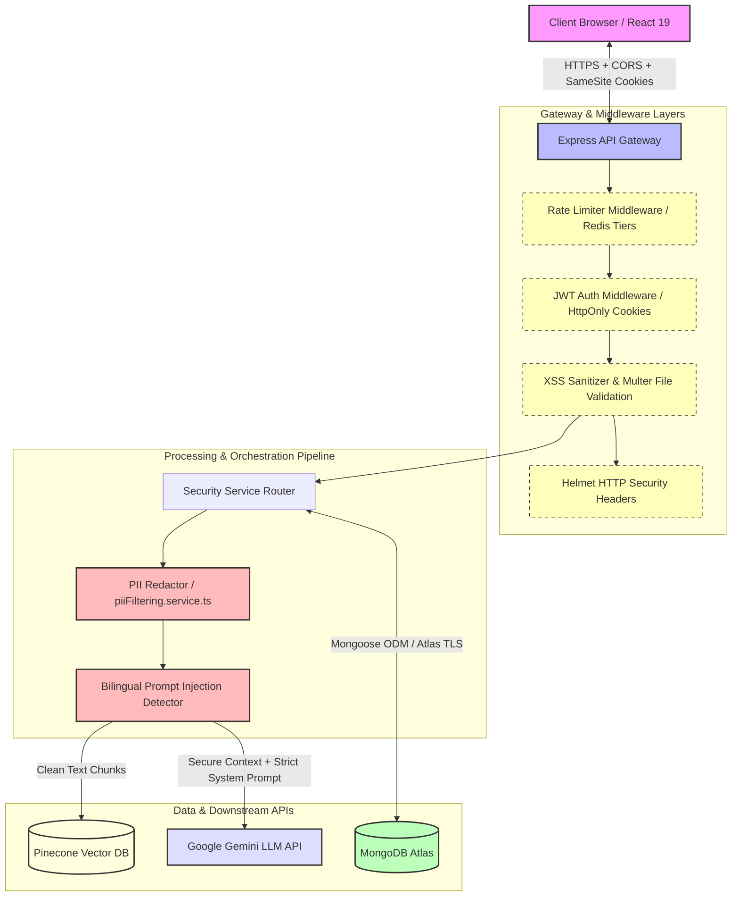

# Security & Safety Overview 🛡️

This document outlines the security architecture, input validation, guardrails, and compliance controls implemented across the Aqdy contract analysis platform.

---

## 🏗️ Security Architecture

The diagram below illustrates how secure boundaries, encryption, token authentication, rate limiting, and filtering mechanisms safeguard user data and protect LLM infrastructure from abuse:

---

## 🛡️ OWASP LLM Top 10 Security Control Mapping

The table below maps each OWASP LLM risk to its implementation status, repository-relative code location, and corresponding security controls.

| OWASP Risk ID | Risk Name | Status | Code Reference | Control Mechanism |
| :--- | :--- | :--- | :--- | :--- |
| **LLM01** | Prompt Injection | **Partial** | `backend/src/services/sanitization.service.ts` `backend/src/routes/upload.route.ts` | **Ingestion**: Strict bilingual injection pattern regex checks (English & Arabic) and template injection markers removal before sending contract clauses to LLM context. **Chat**: *Not Implemented* (only basic Zod structure check is performed on chat inputs). |
| **LLM02** | Insecure Output Handling | **Implemented** | `backend/src/agents/extractor.agent.ts` `backend/src/agents/riskClassifier.agent.ts` `backend/src/agents/redline.agent.ts` | Output schema enforcement using Zod validation; automated JSON repairing; strict data-only rendering in frontend. |
| **LLM03** | Training Data Poisoning | **Accepted Risk** | *External API dependency* | Aqdy uses vetted commercial APIs (Google Gemini) rather than fine-tuning or training base models locally. |
| **LLM04** | Model Denial of Service | **Implemented** | `backend/src/middlewares/rateLimit.ts` `backend/src/controllers/clauseChat.controller.ts` `backend/src/middlewares/upload.middleware.ts` | Rate limiters for IP/Users; maximum clause length truncation (5,000 chars); file upload constraints (10MB); credit verification before processing. |
| **LLM05** | Supply Chain Vulnerabilities | **Implemented** | `package.json` `.github/workflows/ci-cd.yml` | Automated dependency auditing (`npm audit --audit-level=high`) and static secret scanning (`trufflehog`) integrated in the GitHub Actions CI pipeline. |
| **LLM06** | Sensitive Information Disclosure | **Partial** | `backend/src/services/piiFiltering.ts` `backend/src/routes/upload.route.ts` | **Ingestion**: Automated regex-based redact and filter layer replacing sensitive data (National IDs, Credit Cards, Phones, Emails) with `[REDACTED]` prior to DB storage or LLM execution. **Chat**: *Not Implemented* (no PII scrubbing is applied to chat message inputs or LLM streams). |
| **LLM07** | Insecure Plugin Design | **Not Applicable** | *No plugin integrations* | Aqdy agents operate in read-only isolation without write access to databases, plugins, or remote system commands. |
| **LLM08** | Excessive Agency | **Implemented** | `backend/src/agents/extractor.agent.ts` `backend/src/agents/riskClassifier.agent.ts` | LLM response validation restricts actions; models receive minimal read-only state scope and have no terminal/system execution capabilities. |
| **LLM09** | Overreliance | **Implemented** | `backend/src/agents/riskClassifier.agent.ts` `backend/src/controllers/clauseChat.controller.ts` | RAG vector matching against legal knowledge base; LLM confidence score blended with vector similarity score; disclaimers in user interfaces. |
| **LLM10** | Model Theft | **Accepted Risk** | *External API dependency* | Aqdy interfaces with external APIs; proprietary prompts are shielded in the backend environment. Rate limits restrict bulk prompt harvesting. |

---

## 🛡️ Core Security Defenses

### 1. Input Sanitization & Validation
- **HTML & XSS Protection**: All text inputs are filtered using a regex-based HTML/script sanitizer (`sanitizeText` in `security.middleware.ts`) to strip active script blocks, null bytes (`\0`), and generic HTML tags prior to DB storage.
- **File Upload Limits**: File uploads are handled via Multer with strict MIME validation (allowing only `.pdf` and `.docx`) and a hard **10MB** file size limit.
- **Zod Validation**: API endpoints enforce strict JSON body structures using Zod schemas at the router level.

### 2. System Prompt Protection
- **Bilingual Prompt Injection Detection**: Incoming document texts are scanned by `SanitizationService` (`detectPromptInjection` in `security.middleware.ts`) against 20+ English and Arabic jailbreak regex patterns (e.g. instructions override attempts). Malicious payloads are neutralized with `[INSTRUCTION_OVERRIDE_REMOVED]` before being sent to the LLM.
- **Instruction Grounding**: System instructions explicitly command the LLM to restrict responses to the provided contract text and refuse to speculation.

### 3. Output Guardrails & PII Filtering
- **PII Scrubbing**: Before contract texts are written to MongoDB or sent to the LLM context, `piiFiltering.service.ts` redacts Egyptian National IDs, credit cards, emails, US SSNs, and phone numbers.
- **Output Schema Validation**: LLM outputs must validate against rigid Zod schemas. If the model returns malformed JSON, an automated JSON-repair utility corrects it.

### 4. Rate Limiting (Redis-based)
- **Volumetric Rate Limiting**: Implemented via `redisRateLimit.service.ts` to prevent brute force and model exhaustion.
- **IP Tiers**: Unauthenticated users are capped to 20 requests per 15 minutes.
- **User Tiers**: Authenticated users are capped to 10 contract uploads per 24 hours.
- **Interactive Chat Tiers**: Throttled to 20 message exchanges per user/clause per day.

### 5. Authentication & Session Security
- **Stateless Tokens**: Employs JWT for user authentication. Access and refresh tokens are stored in `HttpOnly`, `Secure`, and `SameSite=Strict` cookies.
- **BCrypt Hashing**: All passwords stored in MongoDB are hashed with `bcrypt` (12 salt rounds).
- **Role-Based Access Control (RBAC)**: Endpoint middlewares verify standard vs. admin privileges.

### 6. Secrets Management
- **Doppler Integration**: Development and production secrets are injected dynamically using Doppler to avoid hardcoded credentials in the repository.
- **Zod Env Validation**: All required environment variables are parsed and validated on system startup using a strict schema.

### 7. Helmet HTTP Headers
- Helmet middleware is enabled on the Express application to set security-focused HTTP response headers (e.g., `X-Content-Type-Options`, `Content-Security-Policy`, `Strict-Transport-Security`).

---
