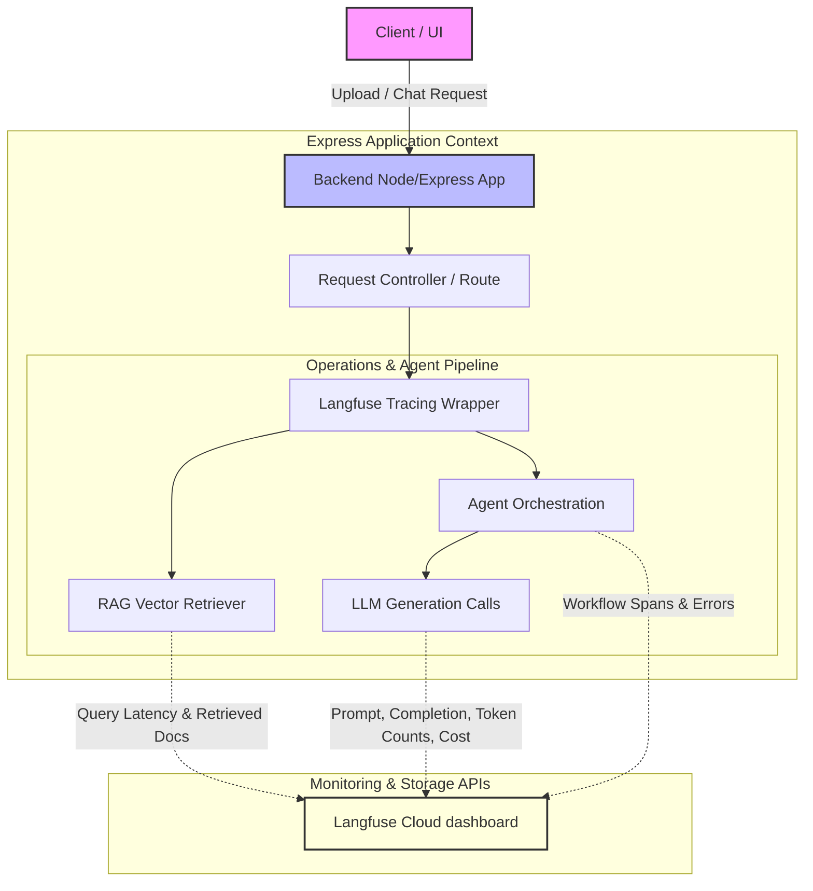

# Observability — Langfuse Tracing 📊

This document details the configuration, integration hooks, and telemetry views for monitoring LLM pipeline executions, latencies, and costs on the Aqdy platform.

---

## 🏗️ Observability Architecture

The diagram below illustrates how telemetry and execution metadata flow from user interactions (ingestion and chat) to the Langfuse dashboards:



---

## ⚙️ Langfuse Setup & Configuration

Aqdy integrates with Langfuse via the `@langfuse/node` SDK. 

### 1. Environment Configuration
Define these keys in your local `backend/.env` file:
```bash
LANGFUSE_PUBLIC_KEY=pk-lf-...
LANGFUSE_SECRET_KEY=sk-lf-...
LANGFUSE_URL=https://cloud.langfuse.com
```

### 2. Client Initialization
Initialized inside `backend/src/config/langfuse.config.ts`, the client checks for keys, instantiates the global `Langfuse` object, and sets up helper methods to build LangChain `CallbackHandler` objects.

---

## 🎯 Traced Components

Every execution path in the analysis workflow is instrumented to capture performance:

### 1. LLM Generations
Every call to Google Gemini (or fallbacks) is logged. We capture:
*   **Prompt**: Raw text and template variables.
*   **Response**: Content and finish reasons.
*   **Parameters**: Temperature, max tokens, system prompts.
*   **Tokens & Cost**: Exact input/output token counts, and dollar expenses calculated dynamically by Langfuse.

### 2. RAG Retrieval Spans
Tracks Pinecone query execution:
*   Logs search query strings.
*   Captured cosine similarity scores of returned chunks.
*   Traces document retrieval latency.

### 3. Agent Tool Call Spans
For multi-agent systems, the orchestrator tracks Extractor, Classifier, and Redline agent executions. It traces routing decisions, payload formatting, schema validation, and tool outputs.

### 4. User ID & Session Metadata
Traces are enriched with context objects for deep query capability:
*   `userId`: Unique MongoDB user identifier.
*   `contractId`: MongoDB ID of the processed contract.
*   `model`: The model ID string (e.g. `gemini-1.5-flash`).

---

## 📈 Dashboard Views

The Langfuse cloud console provides standard metrics dashboards:
*   **Cost Over Time**: Tracks dollar spend per model, user, or contract.
*   **Latency Distribution**: Displays p50, p90, and p99 request latencies to identify bottleneck spans.
*   **Traces Waterfall**: A visual log of individual request executions to debug failures step-by-step.

---

## 📂 Detailed Documentation Reference

*   **[Langfuse SDK Guide](./LANGFUSE_GUIDE.md)** — Code implementation examples, callbacks, and manual span creation.
*   **[Developer Runbook](./RUNBOOK_TROUBLESHOOTING.md)** — Step-by-step troubleshooting, filtering, and quality score evaluations.
