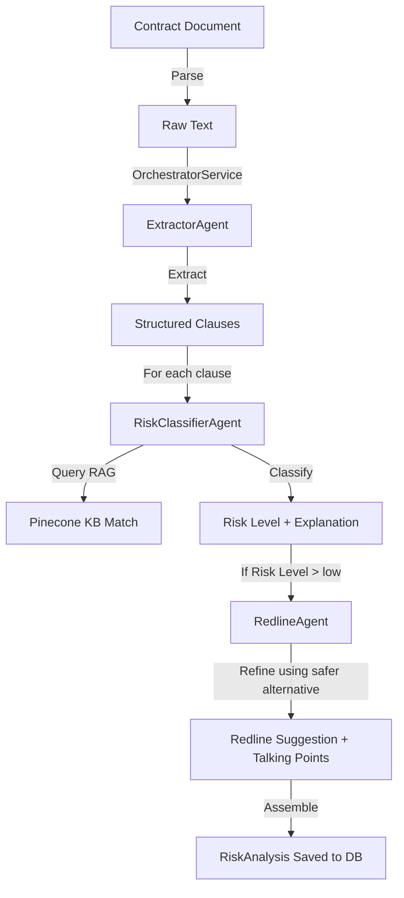

# Multi-Agent Contract Analysis Architecture

This document describes the design, data flows, and components of the multi-agent contract analysis pipeline in the `aqdy-platform` backend.

---

## 1. System Overview

The analysis pipeline uses a structured **Sequential Agent Chaining** pattern orchestrated by `OrchestratorService`. The pipeline processes raw unstructured contract documents (PDF or DOCX), extracts standard clauses, performs semantic RAG-based risk classification on each clause, and generates commercially balanced redline suggestions for identified risks.

---

## 2. Agent Catalog & Responsibilities

### 1. ExtractorAgent (`backend/src/agents/extractor.agent.ts`)
- **Responsibility**: Splits long contract documents into semantic chunks and extracts a structured array of contract clauses (clause number, raw text, and categorized type).
- **Core Technology**: Gemini 3.5 Flash (with fallback to Gemini 3.1 Flash Lite) + Zod-validated output.
- **Key Features**:
  - Automatic language detection (Arabic or English).
  - Smart chunk merging to avoid clause splitting across boundaries.
  - Arabic text normalization (removing diacritics, unified alefs) and numeral conversion.
  - Fail-safe clause repair algorithm for raw model outputs.
  - **OCR Resilience**: Context-aware detection and correction of OCR artifacts (scattered letters, split words, line-break merges, garbled characters) under a strict confidence threshold.
  - **Meaning Preservation**: Strict requirement to preserve clean, correctly formatted clauses exactly as written without alterations or "improvements".

### 2. RiskClassifierAgent (`backend/src/agents/riskClassifier.agent.ts`)
- **Responsibility**: Classifies the risk level of individual clauses (low, medium, high, critical) and provides a bilingual justification.
- **Core Technology**: Pinecone Multilingual RAG + Gemini 3.5 Flash.
- **Key Features**:
  - Blends semantic knowledge base vector matches with LLM reasoning.
  - Automatic confidence calibration.

### 3. RedlineAgent (`backend/src/agents/redline.agent.ts`)
- **Responsibility**: Generates balanced, commercially reasonable, negotiation-ready clause revisions (redlines) to mitigate classified risks, along with bilingual talking points.
- **Core Technology**: Gemini 3.5 Flash + Zod validation.
- **Key Features**:
  - Focuses on mutual fairness rather than extreme one-sided protection.
  - Automatically incorporates safer alternatives from the vector KB as draft templates.
  - Generates billingual negotiation talking points (factual, non-legal advice).

---

## 3. Confidence Calibration Formulas

### Risk Classifier Confidence
To ensure maximum reliability, confidence scores are calculated dynamically by blending retrieval confidence and LLM evaluation confidence:

1. **If a high-similarity Knowledge Base (RAG) match is found**:
   $$\text{Confidence} = 0.5 \times \text{Vector Similarity Score} + 0.5 \times \text{LLM Confidence Score}$$
2. **If no Knowledge Base match is found (or is below the similarity threshold)**:
   $$\text{Confidence} = \text{LLM Confidence Score} \times 0.90 \text{ (No-KB penalty)}$$

---

## 4. Error Isolation & Pipeline Resilience

- **Extractor Resiliency**: Because extraction is the critical first stage, failures here immediately throw an exception. The background queue `AgentExecutionService` handles retries (up to 3 attempts with exponential backoff) before writing an `ANALYSIS_FAILED` audit log.
- **Clause Isolation**: Classification and redlining are fully isolated per clause. If a single clause fails risk classification or redline suggestion generation, it receives fallback values (e.g., `riskLevel: "unknown"`) and the orchestrator continues processing the remaining clauses.
