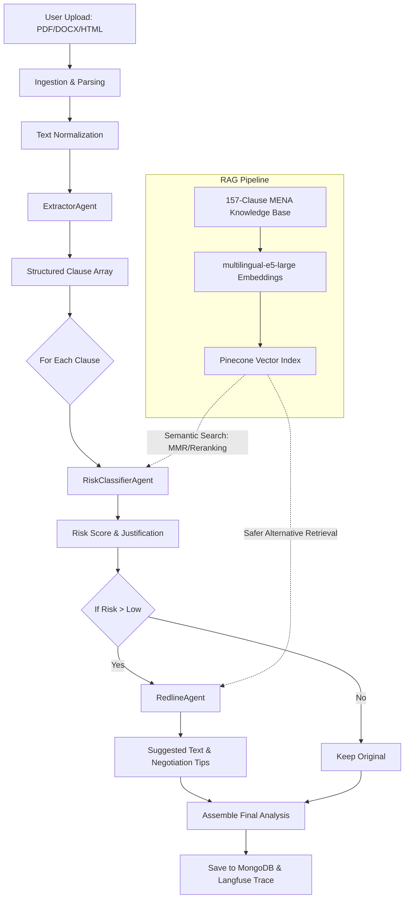

# Aqdy AI Architecture & Pipeline

This document provides a technical deep-dive into the AI architecture of the Aqdy platform, detailing the multi-agent pipeline, LLM integration, and the RAG (Retrieval-Augmented Generation) strategy.
This document is intended for developers, architects, and anyone seeking an in-depth understanding of Aqdy's AI capabilities.
---

## 1. System Architecture Diagram

The following diagram illustrates the flow from document upload to the final analysis result.


The RAG layer supports:

- Query Expansion
- Metadata Filtering
- Semantic Search
- Vector-based MMR
- Category-based MMR
- Confidence Scoring
- Search Result Caching
---

## 2. The Three-Agent Pipeline

Aqdy utilizes a sequential orchestration of three specialized agents via LangChain.

### 2.1 ExtractorAgent
- **Role**: Deconstructs raw, unstructured contract text into a structured JSON array of individual clauses.
- **Inputs**: Raw normalized text (Arabic or English).
- **Outputs**: `[{ "id": string, "title": string, "text": string, "category": string }]`.
- **Orchestration**: Operates as the first stage in the pipeline. It ensures context preservation by merging chunks that might split clauses mid-sentence, providing a coherent input for subsequent agents.

### 2.2 RiskClassifierAgent
- **Role**: Analyzes the legal and commercial risk of a specific clause using semantic context.
- **Inputs**: Clause text + Top-K relevant matches from the Legal Knowledge Base (RAG).
- **Outputs**: Risk Level (Critical, High, Medium, Low), Confidence Score, and Legal Rationale.
- **RAG Feed**: Uses semantic similarity to ground the LLM's parametric memory in real MENA legal norms.

### 2.3 RedlineAgent
- **Role**: Generates commercially balanced redline suggestions and negotiation talking points.
- **Inputs**: Risky clause text + Safer alternatives retrieved from the Knowledge Base.
- **Outputs**: Suggested alternative text, Redline diff, and Bilingual negotiation tips.
- **Strategy**: Focuses on "Safer wording" rather than "Absolute protection" to ensure high negotiation success rates.

## 3. LLM Integration

### 3.1 Model Strategy
- **Primary Model**: `gpt-4o`. Selected for its superior reasoning in complex legal logic and high-fidelity Arabic support.
- **Fallback Model**: `gemini-3.1-flash-lite`. Used automatically if the primary model encounters rate limits or service outages.

### 3.2 Prompt Management and Context Window
All agents utilize dedicated system prompts, which are versioned within the codebase to ensure consistency and traceability.

- **Prompt Injection Protection**: All user-derived text is sanitized before being wrapped in the system instruction.

#### Context Window Handling
The application manages context windows to optimize performance and cost while handling large documents:
- **GPT-4o (Primary)**: While `gpt-4o` has a large inherent context window (128k tokens), the application typically requests a `maxTokens` output of `4096` to control response length and cost. Input documents are pre-processed and chunked to fit within the effective input limits.
- **Gemini 3.1 Flash Lite (Fallback)**: This model offers a significantly larger context window (approximately 1 million tokens), providing robust capacity for processing very large contracts without extensive chunking, especially when used as a fallback.

### 3.3 Prompt Templates
Each agent uses a specific `ChatPromptTemplate` to define its behavior, input structure, and expected output format. These templates are crucial for guiding the LLM to perform its specialized task accurately.

#### ExtractorAgent Prompt
- **Purpose**: To accurately identify and extract discrete legal clauses from raw text, structuring them into a machine-readable format.
- **Inputs**: Raw, normalized contract text (Arabic or English).
- **Outputs**: A JSON array where each object represents a clause, including `id`, `title`, `text`, and `category`.

#### RiskClassifierAgent Prompt
- **Purpose**: To assess the legal and commercial risk associated with a given contract clause, leveraging external legal knowledge.
- **Inputs**:
    - Individual clause text extracted by the `ExtractorAgent`.
    - Top-K relevant legal precedents and safer alternatives retrieved from the RAG pipeline.
- **Outputs**:
    - `riskLevel` (e.g., Critical, High, Medium, Low).
    - `confidenceScore` (numerical representation of LLM's certainty).
    - `legalRationale` (explanation of the risk).

#### RedlineAgent Prompt
- **Purpose**: To generate commercially balanced redline suggestions and negotiation tips for high-risk clauses.
- **Inputs**:
    - The original risky clause text.
    - Contextual information, including safer alternative clauses retrieved from the RAG pipeline.
- **Outputs**:
    - `suggestedAlternativeText` (the redlined version of the clause).
    - `redlineDiff` (a clear comparison highlighting changes).
    - `negotiationTips` (bilingual guidance for discussion).

### 3.4 LangChain Integration
Agents are implemented using LangChain's `RunnableSequence` for robust and modular execution. Each chain typically follows this pattern:

```text
ChatPromptTemplate
        ↓
LLM Model (gpt-4o or gemini-3.1-flash-lite)
        ↓
StringOutputParser
```
This architecture provides consistent prompt formatting, output parsing, and error handling across all agents.

### 3.3 API & Secrets Management
API keys for Google Gemini and OpenAI are managed via a centralized secrets manager and validated at runtime using Zod. Keys are never stored in plain text or committed to the repository.

---

### Knowledge Base Versions

## 4. RAG Pipeline & Knowledge Base

### 4.1 Legal Knowledge Base (KB)
The system is grounded in a **157-clause MENA Legal Knowledge Base**. This KB contains curated examples of risky clauses common in Egyptian and Middle Eastern jurisdictions, paired with safer alternatives and references to relevant laws (e.g., Egyptian Civil Code).

### 4.2 Ingestion & Embedding
- **Formats**: Ingests `legal_kb.json` containing Arabic and English clause pairs.
### Embedding Pipeline

The legal knowledge base is embedded using Pinecone's integrated embedding support with the `multilingual-e5-large` model.

The embedded text is composed of:

```text
clausePattern
+ English explanation
+ Arabic explanation
```

while the remaining fields are stored as metadata to support retrieval-time filtering.
### Pinecone Index Structure

The knowledge base is stored in a serverless Pinecone index named:

```text
legal-kb
```

Metadata includes:

- category
- riskLevel
- explanation_ar
- explanation_en
- whyRisky_ar
- whyRisky_en
- saferAlternative_ar
- saferAlternative_en
- negotiationTips_ar
- negotiationTips_en
- contractTypes
- relatedLaw
- frequency
- applicableRegions
- keywords

### 4.3 Advanced Retrieval Strategy
The `RiskClassifierAgent` and `RedlineAgent` use advanced retrieval to ensure accuracy:
1. **Maximal Marginal Relevance (MMR)**: Used to ensure a diverse set of KB matches are retrieved, preventing the LLM from seeing redundant examples.
### Retrieval Strategy

The retrieval layer supports:

1. Query Expansion using Gemini 3.1 Flash Lite.
2. Metadata filtering by category, risk level, and contract type.
3. Pinecone semantic search.
4. Vector-based Maximal Marginal Relevance (MMR).
5. Category-based MMR to encourage result diversity.
6. Confidence scoring.
7. Stable-hash caching to reduce repeated searches.

### Chunking Strategy
Documents are split into overlapping chunks before embedding and processing by the `ExtractorAgent`. This strategy is crucial for handling large documents and ensuring context is maintained across clause boundaries.
- **Chunk size**: 1000 characters (Note: Verify actual value in `extractor.agent.ts` or related configuration).
- **Chunk overlap**: 200 characters (Note: Verify actual value in `extractor.agent.ts` or related configuration).
This overlap preserves context across clause boundaries and improves retrieval quality.

### Prompt Templates

All agents use dedicated system prompts implemented with LangChain's
`ChatPromptTemplate`.

#### ExtractorAgent

Uses:

```ts
EXTRACTION_SYSTEM_PROMPT
```

Returns:

```json
[
  {
    "clauseNumber": 1,
    "clauseText": "...",
    "clauseType": "termination"
  }
]
```

---

#### RiskClassifierAgent

Uses:

```ts
RISK_CLASSIFICATION_SYSTEM_PROMPT
```

Returns:

- riskLevel
- explanation
- whyRisky
- saferAlternative
- confidence
- relatedLaw

---

### LangChain Integration

Agents are implemented using LangChain's `RunnableSequence`.

Each chain follows:

```text
ChatPromptTemplate
        ↓
LLM Model
        ↓
StringOutputParser
```

This architecture provides consistent prompt formatting and output parsing across all agents.

#### RedlineAgent

Uses:

```ts
REDLINE_SYSTEM_PROMPT
```

Returns:

- originalClause
- redlinedClause
- summary
- negotiationTips

#### ExtractorAgent Prompt
Converts raw contract text into structured clauses.
- **Input**: Raw contract text.
- **Output**: JSON array of clauses.

#### RiskClassifierAgent Prompt
Evaluates legal and commercial risk using retrieved knowledge base context.
- **Input**: Clause text, retrieved examples from the RAG pipeline.
- **Output**: Risk level, confidence score, explanation.

#### RedlineAgent Prompt
Generates safer wording and negotiation guidance.
- **Input**: Clause text, retrieved safer alternatives from the RAG pipeline.
- **Output**: Suggested clause, negotiation tips.

---

## 5. Concurrency & Reliability

### 5.1 Concurrency Control
The pipeline uses a semaphore to cap concurrent LLM requests at **3**. 
- **Rationale**: This prevents overloading the API quota, manages latency for the end-user, and ensures the backend remains responsive during heavy load.

### 5.2 Quota & Retry Logic
- **Exponential Backoff**: If a `429 (Rate Limit)` or `503` error is received from Gemini or OpenAI, the system retries with a delay (1s -> 2s -> 4s).
- **Graceful Degradation**: After 3 failed retries with the primary model, the pipeline switches to the fallback model to complete the request.

---

## 6. Request Lifecycle Summary

1. **Upload**: User sends a file.
2. **Ingestion**: File is converted to text; PII is redacted.
3. **Extraction**: `ExtractorAgent` maps the structure.
4. **Retrieval**: Semantic search finds matching legal risks in Pinecone.
5. **Analysis**: `RiskClassifier` + `RedlineAgent` process each clause in parallel (subject to concurrency limits).
6. **Assembly**: Results are merged into a final `RiskAnalysis` object.
7. **Storage**: Data is saved to MongoDB; full trace is sent to Langfuse for observability.
### Query Expansion

Before querying Pinecone, the system optionally expands the user's clause using Gemini 3.1 Flash Lite.

This generates:

- legal synonyms
- bilingual terms
- related concepts

which improves recall for Arabic and English clauses.
### Caching

RAG search results are cached using stable hashes to avoid repeated Pinecone requests and reduce latency.

### Confidence Scoring

Similarity scores are transformed into confidence levels ranging from 0.4 to 0.95 and determine whether a match is considered reliable.
---
*Last Updated: 2025-05-22*