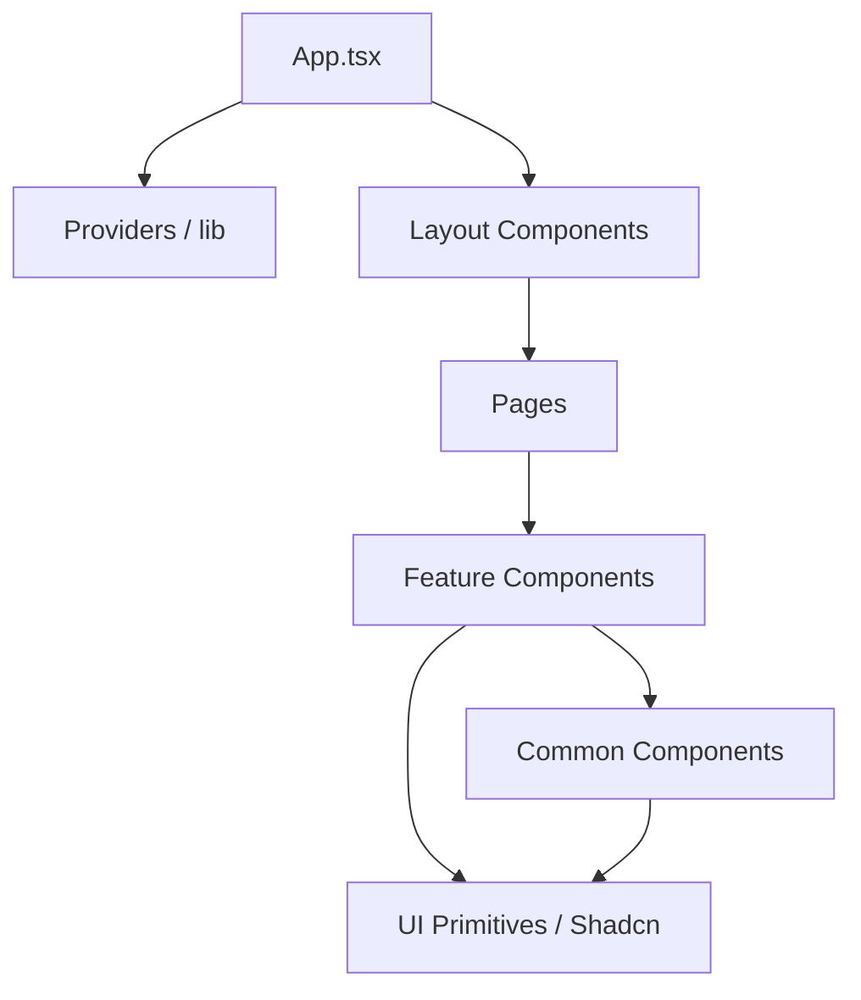

# Component Architecture - Aqdy Platform

This document outlines the component structure and architectural patterns used in the Aqdy Platform frontend. We follow a modular, feature-based approach to ensure scalability, maintainability, and high performance.

## 🏛️ Architectural Overview

The project follows a **Modified Atomic Design** combined with **Feature-Based Module** organization. This allows us to separate generic UI primitives from complex business logic.

---

## 📂 Directory Structure

### 1. `src/components/ui/` (Atomic Primitives)
- **Purpose**: Low-level, presentational components (Buttons, Inputs, Cards).
- **Source**: Primarily powered by **Shadcn UI** and **Radix UI**.
- **Rules**: Should be stateless and highly reusable. Avoid business logic here.

### 2. `src/components/layout/` (Structural)
- **Purpose**: Global structural components like `MainLayout`, `Navigation`, and `Footer`.
- **Logic**: Handles global themes, language direction (LTR/RTL), and SEO metadata.

### 3. `src/components/features/` (Feature Modules)
- **Purpose**: Complex components tied to specific business domains (e.g., `ContractUpload`).
- **Logic**: Contains feature-specific state, API calls (via TanStack Query), and validation.

### 4. `src/components/` (Common)
- **Purpose**: Shared components that aren't tied to a specific feature but are more complex than basic UI primitives (e.g., `LanguageSwitcher`, `DisclaimerModal`).

---

## 🎨 Component Design Patterns

### 1. Premium Visuals & Micro-animations
We use **Framer Motion** for all transitions and interactive states.
- Components should use `AnimatePresence` for exit animations.
- Hover states and loading indicators should feel "premium" and smooth.

### 2. RTL-First Strategy
To support Arabic and English seamlessly, we use:
- **Tailwind Logical Properties**: Using `ms-` (margin-start) instead of `ml-` (margin-left), and `pe-` instead of `pr-`.
- **Dynamic Direction**: Components derive direction from the `i18next` language state.

### 3. Controlled vs. Uncontrolled
- Use **Controlled Components** for forms and inputs to maintain a single source of truth in the feature state.
- Use **Refs** only when necessary for direct DOM access (e.g., hidden file inputs).

---

## 🔄 Data Flow & State Management

-   **Server State**: Managed via **TanStack Query**. Components should use custom hooks or direct query calls to fetch and cache data.
-   **UI State**: Managed locally with `useState` or `useReducer`.
-   **Global State**: Minimal use of global state; prefer Context API for themes or language settings.
-   **Translations**: All text must be wrapped in `t()` from `react-i18next`.

## 🧪 Testing Strategy

-   **Unit Tests**: Located in `tests/`. Focus on component logic and rendering.
-   **Integration Tests**: Test the interaction between features and mock APIs (using MSW).
-   **RTL Verification**: Specific tests (e.g., `direction.test.tsx`) ensure that layout switches correctly between `rtl` and `ltr`.

---

## 📝 Coding Standards for Components

1.  **TypeScript**: Every component must have defined `Props` interfaces.
2.  **Arabic-First Support**: Always provide Arabic translations and ensure RTL layouts are tested.
3.  **Performance**: Use `React.lazy` for page-level components and `Suspense` for loading states.
4.  **Accessibility**: Ensure correct `aria-` labels and keyboard navigation support (standard in Radix UI).
