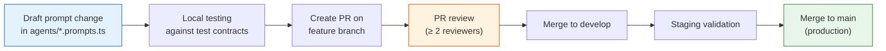

# Prompt Library

This document catalogs all production prompts used in the Aqdy contract analysis pipeline, their file locations, purpose, output schemas, and the prompt versioning workflow.

---

## Table of Contents

1. [Prompt Catalog](#prompt-catalog)
2. [Prompt File Map](#prompt-file-map)
3. [Detailed Prompt Documentation](#detailed-prompt-documentation)
4. [Prompt Versioning Workflow](#prompt-versioning-workflow)
5. [Prompt Engineering Guidelines](#prompt-engineering-guidelines)

---

## Prompt Catalog

| # | Prompt Name | Agent | File | Purpose |
|---|-------------|-------|------|---------|
| 1 | `EXTRACTOR_SYSTEM_PROMPT` | ExtractorAgent | [`extractor.prompts.ts`](file:///g:/proj/aqdy-platform/backend/src/agents/extractor.prompts.ts#L36) | Instructs the LLM to extract all discrete clauses from contract text with exact text preservation |
| 2 | `buildExtractionUserPrompt()` | ExtractorAgent | [`extractor.prompts.ts`](file:///g:/proj/aqdy-platform/backend/src/agents/extractor.prompts.ts#L150) | Dynamic user prompt with language, chunk info, and contract text |
| 3 | `RISK_CLASSIFIER_SYSTEM_PROMPT` | RiskClassifierAgent | [`riskClassifier.prompts.ts`](file:///g:/proj/aqdy-platform/backend/src/agents/riskClassifier.prompts.ts#L11) | Instructs the LLM to classify clause risk with bilingual explanation and Egyptian law references |
| 4 | `buildClassificationUserPrompt()` | RiskClassifierAgent | [`riskClassifier.prompts.ts`](file:///g:/proj/aqdy-platform/backend/src/agents/riskClassifier.prompts.ts#L66) | Dynamic user prompt with clause text, type, language, and optional KB reference context |
| 5 | `REDLINE_SYSTEM_PROMPT` | RedlineAgent | [`redline.prompts.ts`](file:///g:/proj/aqdy-platform/backend/src/agents/redline.prompts.ts#L12) | Instructs the LLM to generate balanced, commercially reasonable redline revisions with bilingual explanation and negotiation talking points |
| 6 | `buildRedlineUserPrompt()` | RedlineAgent | [`redline.prompts.ts`](file:///g:/proj/aqdy-platform/backend/src/agents/redline.prompts.ts#L66) | Dynamic user prompt with clause text, risk level, type, language, and optional KB safer alternative |
| 7 | `CONTRACT_ANALYSIS_SYSTEM_PROMPT` | (Base/shared) | [`langchain.config.ts`](file:///g:/proj/aqdy-platform/backend/src/config/langchain.config.ts#L74) | Base Aqdy persona prompt — general legal AI assistant for MENA region |
| 8 | `EXTRACTION_SYSTEM_PROMPT` | (Legacy) | [`langchain.config.ts`](file:///g:/proj/aqdy-platform/backend/src/config/langchain.config.ts#L88) | Early-version extraction prompt (superseded by `extractor.prompts.ts`) |
| 9 | `RISK_CLASSIFICATION_SYSTEM_PROMPT` | (Legacy) | [`langchain.config.ts`](file:///g:/proj/aqdy-platform/backend/src/config/langchain.config.ts#L103) | Early-version classification prompt (superseded by `riskClassifier.prompts.ts`) |
| 10 | `REDLINE_SYSTEM_PROMPT` (config) | (Legacy) | [`langchain.config.ts`](file:///g:/proj/aqdy-platform/backend/src/config/langchain.config.ts#L122) | Early-version redline prompt (superseded by `redline.prompts.ts`) |
| 11 | RAG Query Expansion prompt | RAGService | [`rag.service.ts`](file:///g:/proj/aqdy-platform/backend/src/services/rag.service.ts#L230) | Inline system prompt for generating bilingual search term expansion |

---

## Prompt File Map

```
backend/src/
├── agents/
│   ├── extractor.prompts.ts       ← Production prompts for Extractor Agent
│   ├── riskClassifier.prompts.ts  ← Production prompts for Risk Classifier Agent
│   └── redline.prompts.ts         ← Production prompts for Redline Agent
├── config/
│   └── langchain.config.ts        ← Legacy/base prompt templates (Week 1 originals)
└── services/
    └── rag.service.ts             ← Inline query expansion prompt
```

> [!NOTE]
> The production prompts in `agents/*.prompts.ts` **supersede** the earlier versions in `langchain.config.ts`. The `langchain.config.ts` prompts were the initial drafts from Week 1; the `agents/*.prompts.ts` files contain the refined, tested, production-ready versions with few-shot examples, bilingual support, and Zod-compatible output schemas. The `langchain.config.ts` prompts are retained for backward compatibility with the `buildChain()` helper but are not used by the current agent implementations.

---

## Detailed Prompt Documentation

### 1. Extractor System Prompt

**File**: [`extractor.prompts.ts`](file:///g:/proj/aqdy-platform/backend/src/agents/extractor.prompts.ts#L36)
**Constant**: `EXTRACTOR_SYSTEM_PROMPT`
**Used by**: [`ExtractorAgent.callLLM()`](file:///g:/proj/aqdy-platform/backend/src/agents/extractor.agent.ts#L165)

**Key characteristics**:
- Role: "specialized contract clause extraction agent for the Aqdy legal AI platform"
- Defines a **19-type clause taxonomy**: termination, payment, liability, confidentiality, non-compete, force-majeure, governing-law, indemnification, warranty, intellectual-property, dispute-resolution, employment-terms, probation, benefits, obligations, penalties, renewal, notice, other
- Contains **2 few-shot examples**: one English employment contract, one Arabic employment contract (عقد عمل)
- Instructs exact text preservation — no summarization or paraphrasing for clean text
- Detects Arabic clause markers (مادة، بند، فقرة، أولاً، ثانياً)
- Output format: JSON array only, no markdown, no extra text
- **OCR Resilience**: Instructions for context-aware correction of OCR artifacts (scattered letters, split words, line-break merges, garbled characters).
- **High Confidence Rule**: Corrects OCR artifacts only when the intended text is clear from the surrounding context; does not invent or assume legal text.
- **Meaning Preservation Rule**: Never rewrites, paraphrases, modernizes, or improves clean contract text.

**Output schema**:
```json
[
  {
    "clauseNumber": 1,
    "clauseText": "exact text of the clause",
    "clauseType": "one of the 19 types"
  }
]
```

**LLM parameters**: `temperature: 0.1`, `maxTokens: 8192`

---

### 2. Extraction User Prompt Builder

**File**: [`extractor.prompts.ts`](file:///g:/proj/aqdy-platform/backend/src/agents/extractor.prompts.ts#L150)
**Function**: `buildExtractionUserPrompt(contractText, language, chunkIndex?, totalChunks?)`

**Dynamic template**:
```
[Processing chunk {N} of {total}]    ← only for multi-chunk contracts

Contract language: {Arabic (العربية) | English}

Extract all clauses from the following contract text:

"""
{contractText}
"""
```

---

### 3. Risk Classifier System Prompt

**File**: [`riskClassifier.prompts.ts`](file:///g:/proj/aqdy-platform/backend/src/agents/riskClassifier.prompts.ts#L11)
**Constant**: `RISK_CLASSIFIER_SYSTEM_PROMPT`
**Used by**: [`RiskClassifierAgent.classify()`](file:///g:/proj/aqdy-platform/backend/src/agents/riskClassifier.agent.ts#L150)

**Key characteristics**:
- Role: "contract risk classification expert"
- Defines **4 risk levels** with explicit criteria:
  - `low`: Standard clauses, no unusual risk
  - `medium`: Requires attention, mild restrictions
  - `high`: Highly restrictive, significantly favors one party
  - `critical`: Illegal, void, or catastrophic (e.g., mandatory overtime without pay, 6-month probation)
- Requires **bilingual explanation** in both Arabic and English
- When KB context is provided: aligns classification with reference risk level and incorporates Egyptian law citations (Civil Code, Labor Law No. 12/2003, Data Protection Law No. 151/2020, etc.)
- When no KB context: relies on general legal training

**Output schema**:
```json
{
  "riskLevel": "low | medium | high | critical",
  "explanation": {
    "ar": "شرح مفصل للمخاطر...",
    "en": "Detailed explanation of the risk..."
  },
  "confidence": 0.85
}
```

**LLM parameters**: `temperature: 0.1`, `maxTokens: 2048`

---

### 4. Classification User Prompt Builder

**File**: [`riskClassifier.prompts.ts`](file:///g:/proj/aqdy-platform/backend/src/agents/riskClassifier.prompts.ts#L66)
**Function**: `buildClassificationUserPrompt(clauseText, clauseType, language, kbMatch?)`

**Dynamic template — WITH KB match**:
```
Analyze and classify the following contract clause:

Clause Text:
"""
{clauseSnippet (max 1200 chars)}
"""

Clause Category/Type: {clauseType}
Contract Language: {Arabic (العربية) | English}

### Context from Legal Knowledge Base (Close Match Found)
- KB Reference ID: {id}
- Reference Category: {category}
- Reference Risk Level: {riskLevel}
- Matching Pattern: "{clausePattern}"
- Reference Explanation (AR): {explanation.ar}
- Reference Explanation (EN): {explanation.en}
- Why Risky (AR): {whyRisky.ar}
- Why Risky (EN): {whyRisky.en}
- Related Egyptian/MENA Law: {relatedLaw}

Note: This clause is highly similar to the above KB reference. Align your risk level...
```

**Dynamic template — WITHOUT KB match**:
```
...same header...

No close match was found in the Legal Knowledge Base for this clause text.
Please perform classification based on general legal expertise under Egyptian and MENA regulations.
```

---

### 5. Redline System Prompt

**File**: [`redline.prompts.ts`](file:///g:/proj/aqdy-platform/backend/src/agents/redline.prompts.ts#L12)
**Constant**: `REDLINE_SYSTEM_PROMPT`
**Used by**: [`RedlineAgent.generate()`](file:///g:/proj/aqdy-platform/backend/src/agents/redline.agent.ts#L111)

**Key characteristics**:
- Role: "contract redlining expert"
- **7 critical guidelines** embedded in the prompt:
  1. Suggestions, NOT legal advice
  2. Mandatory bilingual disclaimer (hardcoded Arabic and English text)
  3. Balance & fairness — commercially reasonable compromises, not extreme protection
  4. Safer alternative integration — use KB alternative as template when available
  5. Legal intent preservation — keep the clause's original purpose
  6. Arabic/bilingual output rules — suggestedText matches contract language; explanation/talkingPoints always bilingual
  7. Output format — JSON only

**Output schema**:
```json
{
  "suggestedText": "The fully redlined clause text in the language of the contract.",
  "explanation": {
    "ar": "شرح واضح وباللغة العربية...",
    "en": "Clear English explanation..."
  },
  "talkingPoints": {
    "ar": ["نقطة تفاوضية 1", "نقطة تفاوضية 2"],
    "en": ["Negotiation point 1", "Negotiation point 2"]
  },
  "confidence": 0.9
}
```

**LLM parameters**: `temperature: 0.2`, `maxTokens: 2048`

---

### 6. Redline User Prompt Builder

**File**: [`redline.prompts.ts`](file:///g:/proj/aqdy-platform/backend/src/agents/redline.prompts.ts#L66)
**Function**: `buildRedlineUserPrompt(clauseText, riskLevel, clauseType, language, saferAlternative?)`

**Dynamic template — WITH safer alternative**:
```
Generate redline suggestions for the following contract clause:

Original Clause Text:
"""
{clauseSnippet (max 1200 chars)}
"""

Clause Category/Type: {clauseType}
Current Risk Level: {riskLevel}
Contract Language: {Arabic (العربية) | English}

### Guiding Safer Alternative (from Legal Knowledge Base):
"""
{alternativeSnippet (max 900 chars)}
"""

Please adapt this safer alternative to the original clause and keep the same legal intent.
```

**Dynamic template — WITHOUT safer alternative**:
```
...same header...

No pre-defined safer alternative was found in the Legal Knowledge Base.
Draft a fair, risk-mitigating revision based on expert negotiation practice.
```

---

### 7. RAG Query Expansion Prompt

**File**: [`rag.service.ts`](file:///g:/proj/aqdy-platform/backend/src/services/rag.service.ts#L230)
**Type**: Inline system prompt (not exported as a constant)

**System prompt**:
```
You are a legal search query expansion assistant. Your task is to analyze the user's
contract clause query (which may be in English or Arabic) and generate related legal
concepts, synonyms, search keywords, and bilingual translations. Output ONLY the
expansion terms separated by spaces, with no introductory text, conversational filler,
or markdown.
```

**Used by**: `ragService.expandQuery()` — called via the fallback model (Gemini 3.1 Flash Lite) with `temperature: 0.1` for speed and cost efficiency.

---

### 8–10. Legacy Prompts (langchain.config.ts)

**File**: [`langchain.config.ts`](file:///g:/proj/aqdy-platform/backend/src/config/langchain.config.ts)

These are the **Week 1 original prompts** that were used during initial development. They are shorter, less detailed versions of the production prompts and do not include few-shot examples, the clause type taxonomy, or bilingual output instructions.

| Constant | Lines | Status |
|----------|-------|--------|
| `CONTRACT_ANALYSIS_SYSTEM_PROMPT` | L74–L86 | Active — base persona prompt (shared context) |
| `EXTRACTION_SYSTEM_PROMPT` | L88–L101 | **Superseded** by `extractor.prompts.ts` |
| `RISK_CLASSIFICATION_SYSTEM_PROMPT` | L103–L120 | **Superseded** by `riskClassifier.prompts.ts` |
| `REDLINE_SYSTEM_PROMPT` (config) | L122–L136 | **Superseded** by `redline.prompts.ts` |

> [!WARNING]
> The legacy prompts in `langchain.config.ts` are **NOT used by the production pipeline**. They remain in the codebase for the `buildChain()` helper function. If editing prompts, always modify the `agents/*.prompts.ts` files.

---

## Prompt Versioning Workflow

Aqdy prompts are versioned through **Git-based history** — each prompt file is a TypeScript source file tracked in version control, providing a complete audit trail of every change.

### Current Workflow



### Git History for Prompts

Prompt evolution is tracked through Git commits. The key milestones in prompt development:

| Commit | Message | Change |
|--------|---------|--------|
| `64e32ad` | `chore(llm): llm wrapper class and langchain setup` | Initial `langchain.config.ts` with base prompt templates |
| `2a292ab` | `feat(agents): implement extractor agent` | Created `extractor.prompts.ts` with few-shot examples |
| `908bf7c` | `feat(agent): risk classifier agent` | Created `riskClassifier.prompts.ts` with KB integration |
| `a6a34dc` | `feat(agent): redline agent` | Created `redline.prompts.ts` with legal disclaimer |
| `1eec158` | `feat: enhance performance monitoring and caching` | Prompt refinements for consistency |
| `4be6227` | `chore: changed primary model to gpt-4o` | Model change (GPT-4o replaces Gemini as primary) |

### Viewing Prompt History

To see the full change history for any prompt file:

```bash
# All changes to extractor prompts
git log --oneline -p -- backend/src/agents/extractor.prompts.ts

# All changes to classifier prompts
git log --oneline -p -- backend/src/agents/riskClassifier.prompts.ts

# All changes to redline prompts
git log --oneline -p -- backend/src/agents/redline.prompts.ts

# All prompt changes across the project
git log --oneline -- backend/src/agents/*.prompts.ts backend/src/config/langchain.config.ts
```

### A/B Testing

> [!NOTE]
> **No formal A/B testing framework** is currently in place for prompt variants. Prompt quality is evaluated during development by running test contracts through the pipeline and comparing outputs manually. The team evaluates accuracy against the legal KB ground truth and reviews bilingual output quality.
>
> **Planned improvements**: Langfuse supports prompt management and A/B testing natively. A future iteration could migrate prompts to Langfuse's prompt registry, enabling:
> - Named prompt versions with rollback
> - A/B testing with traffic splitting
> - Automated evaluation metrics per prompt version

### Prompt Change Checklist

When modifying any production prompt, follow this checklist:

- [ ] Update the prompt in the relevant `agents/*.prompts.ts` file
- [ ] Run the agent's integration tests against both Arabic and English test contracts
- [ ] Verify the output passes Zod schema validation
- [ ] Check that bilingual output is present and coherent in both languages
- [ ] Test with edge cases: very short clauses, very long clauses, mixed-language contracts
- [ ] Create a PR with clear description of what changed and why
- [ ] Get review from at least 2 team members (per DEFINITION OF DONE)
- [ ] After merge, monitor Langfuse traces for any quality regression

---

## Prompt Engineering Guidelines

### Principles Applied

1. **Explicit output format**: Every system prompt specifies the exact JSON schema. No ambiguity in what the LLM should return.
2. **Few-shot examples**: The extractor prompt includes real examples (both English and Arabic) to ground the LLM's behavior.
3. **Role separation**: System prompts define the role; user prompts carry the data. Never mix instructions with data.
4. **Bilingual-first design**: All output schemas require both Arabic and English fields. Language-specific rules are explicit in the prompt.
5. **Grounding via RAG**: Classification and redline prompts dynamically inject KB context when available, reducing hallucination.
6. **Defensive instructions**: Prompts include explicit rules about what NOT to do (e.g., "do NOT summarize", "do NOT add markdown", "return ONLY valid JSON").
7. **Legal disclaimers**: The redline prompt hardcodes mandatory bilingual disclaimers to ensure compliance.
8. **Truncation**: User prompt builders use `truncatePromptText()` to cap clause text at 1,200 characters and safer alternatives at 900 characters, preventing context window overflow.

### Temperature Strategy

| Agent | Temperature | Rationale |
|-------|-------------|-----------|
| Extractor | 0.1 | Deterministic extraction — exact text preservation |
| Risk Classifier | 0.1 | Consistent risk classifications across runs |
| Redline | 0.2 | Slightly more creative for negotiation suggestions |
| RAG Query Expansion | 0.1 | Deterministic term generation |

---

*Last updated: Sprint 2. Owners: Engineering team. This document should be updated whenever prompts are added, modified, or deprecated.*
