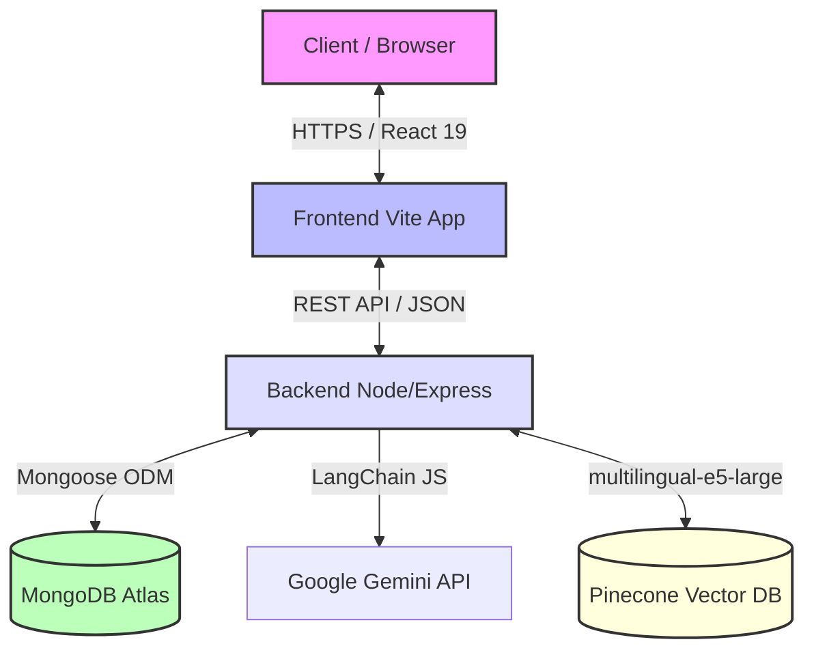

# Aqdy Platform Documentation Index 📚

Welcome to the central developer documentation index for the **Aqdy Platform** — an AI-powered contract risk analyzer designed for the Arabic-speaking market. 

This repository contains two main applications (an Express backend and a Vite frontend) along with a dedicated semantic RAG (Retrieval-Augmented Generation) pipeline.

---

## 🏗️ High-Level System Architecture

The following diagram illustrates how the frontend, backend, vector storage (Pinecone), and relational database (MongoDB) interact during the contract analysis workflow:

---

## 📂 Documentation Directory Map

Our technical guides are compartmentalized into domain-specific folders to keep instructions concise and focused:

| Domain | File / Guide | Description |
|:---|:---|:---|
| **🚀 DevOps** | [Local Setup](./DEVOPS/LOCAL_SETUP.md) | Standard developer installation guide for backend, frontend, and DB. |
| | [Deployment Guide](./DEVOPS/DEPLOYMENT.md) | Multi-stage Dockerization, docker-compose configuration, and CI/CD tips. |
| **💻 Backend** | [LLM Setup](./BACKEND/LLM_SETUP.md) | LangChain pipeline, ChatGoogleGenerativeAI, and model retry/fallback policies. |
| **🎨 Frontend** | [Frontend Overview](./FRONTEND/README.md) | React 19, Tailwind 4, logical RTL spacing, and state management. |
| | [Component Architecture](./FRONTEND/COMPONENT_ARCHITECTURE.md) | Feature-based Atomic design pattern, animations, and standards. |
| **🗄️ Database** | [Connection Setup](./DATABASE/CONNECTION_SETUP.md) | MongoDB Atlas cloud setup, connection strings, and integration test DB rules. |
| | [Database Schema](./DATABASE/DATABASE_SCHEMA.md) | Detailed schema specs for Contracts, RiskAnalyses, and AuditLogs. |
| **🤖 RAG & AI** | [RAG & Embedding Pipeline](./RAG/rag-and-embedding.md) | Search mechanics with Pinecone, E5 embeddings, and retrieval flow. |
| | [KB Curation Process](./RAG/KB_CURATION_PROCESS.md) | Maintenance workflow for adding, modifying, or removing legal clauses. |
| | [Legal KB Catalog](./RAG/LEGAL_KB.md) | Catalog of all 50 risky clauses in `legalKB.json` with code/law mappings. |
| | [MENA Business Norms](./RAG/MENA_BUSINESS_NORMS.md) | Localization study on regional civil law, labor codes, and specific contract risks. |
| **🧪 QA & Test** | [Testing Guidelines](./TESTING/README.md) | Jest and Vitest suites, MSW API mocking, and coverage rules. |

---

## 🚦 Getting Started Roadmap

If you are a new developer onboarding to the Aqdy project, we recommend reading the guides in this order:

1. **Step 1: Environment Setup** — Follow the [Local Development Setup](./DEVOPS/LOCAL_SETUP.md) to set up node packages, database variables, and local servers.
2. **Step 2: Database Connection** — Make sure your Atlas credentials align with [Database Connection Setup](./DATABASE/CONNECTION_SETUP.md).
3. **Step 3: Understand the RAG Engine** — Read the [RAG & Embedding Pipeline](./RAG/rag-and-embedding.md) and learn how we query Pinecone with `multilingual-e5-large` to ground LLM analysis.
4. **Step 4: Explore Frontend Design** — Familiarize yourself with our atomic structure and RTL guidelines in [Component Architecture](./FRONTEND/COMPONENT_ARCHITECTURE.md).
5. **Step 5: Code Quality & Testing** — Ensure any new pull requests pass the Jest/Vitest standard defined in [Testing Guidelines](./TESTING/README.md).

---

> [!NOTE]
> **API Keys & Credentials:** The platform integrates heavily with external cloud providers (Google AI Studio, Pinecone, Langfuse, MongoDB Atlas). All keys must be defined in your local `backend/.env` file. Refer to the respective guides above for example `.env` schemas.

> [!IMPORTANT]
> **Arabic-First / RTL Support:** Aqdy is designed primarily for the Middle East & North Africa (MENA) market. Every UI element and backend risk assessment prompt is localized and tested for both Arabic and English. Please respect these structural guidelines when making code modifications.
