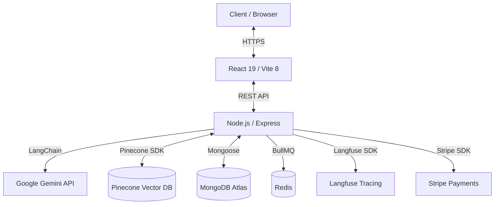

# Aqdy Platform — Documentation Index

**AI-powered contract risk analyzer for the Arabic-speaking market.**  
Aqdy helps freelancers, startups, and small businesses understand legal contracts through clause-by-clause risk analysis with bilingual (Arabic/English) support.

---

## Table of Contents

| Section | Contents |
|:---|:---|
| **01 — Architecture** | System overview, database schema, API specification (Swagger) |
| **02 — Setup** | Local development, Docker deployment, CI/CD pipeline |
| **03 — AI Pipeline** | Model selection, prompt library, RAG, multi-agent system, multimodality, evaluation |
| **04 — Security** | OWASP LLM Top 10 coverage, guardrails, rate limiting |
| **05 — Observability** | Langfuse tracing, cost & latency monitoring |
| **06 — Testing** | Unit/integration tests, E2E tests, quality gates |
| **07 — User Guide** | How to use the platform |
| **08 — Appendix** | Accessibility, localization, credits |

---

## Quick Links

### Technical Documentation
- [System Architecture](./01-ARCHITECTURE/OVERVIEW.md) — Architecture diagram and component interaction
- [Database Schema](./01-ARCHITECTURE/DATABASE-SCHEMA.md) — MongoDB collections, indexes, and relationships
- [API Specification](./01-ARCHITECTURE/API-SPEC.md) — OpenAPI/Swagger REST API docs

### Getting Started
- [Local Development Setup](./02-SETUP/LOCAL-DEV.md) — Prerequisites, .env config, running backend & frontend
- [Deployment Guide](./02-SETUP/DEPLOYMENT.md) — Docker, docker-compose, AWS CDK
- [CI/CD Pipeline](./02-SETUP/CI-CD.md) — GitHub Actions, quality gates, code coverage

### AI Pipeline (Core)
- [Model Selection Rationale](./03-AI-PIPELINE/MODEL-SELECTION.md) — Gemini primary, GPT-4o fallback, cost analysis
- [Prompt Library](./03-AI-PIPELINE/PROMPT-LIBRARY.md) — Catalog of production prompts with versioning
- [RAG Pipeline](./03-AI-PIPELINE/RAG.md) — Ingestion, chunking, embedding, retrieval (Pinecone + MMR reranking)
- [Multi-Agent System](./03-AI-PIPELINE/AGENTS.md) — 3-agent sequential pipeline (Extractor → Classifier → Redline)
- [Multimodal AI](./03-AI-PIPELINE/MULTIMODAL.md) — speech, and generation capabilities
- [Evaluation](./03-AI-PIPELINE/EVALUATION.md) — LLM-as-a-Judge, 4 quality metrics, human feedback

### Security & Observability
- [Security Overview](./04-SECURITY/OVERVIEW.md) — OWASP LLM Top 10, input sanitization, PII filtering, rate limiting
- [RBAC](./04-SECURITY/RBAC.md) — Role-Based Access Control Hierarchy
- [Langfuse Tracing](./05-OBSERVABILITY/TRACING.md) — LLM call traces, cost tracking, latency monitoring

### Quality Assurance
- [Unit & Integration Tests](./06-TESTING/UNIT-INTEGRATION.md) — Jest/Vitest, 60% coverage gate
- [End-to-End Tests](./06-TESTING/E2E.md) — Playwright test scenarios

### User Documentation
- [User Guide](./07-USER-GUIDE/README.md) — How to upload, analyze, and review contracts

### Reference
- [Accessibility (WCAG 2.1 AA)](./08-APPENDIX/ACCESSIBILITY.md)
- [Localization (Arabic/English)](./08-APPENDIX/LOCALIZATION.md)
- [Credits & Attributions](./08-APPENDIX/CREDITS.md)

---

## Architecture at a Glance

